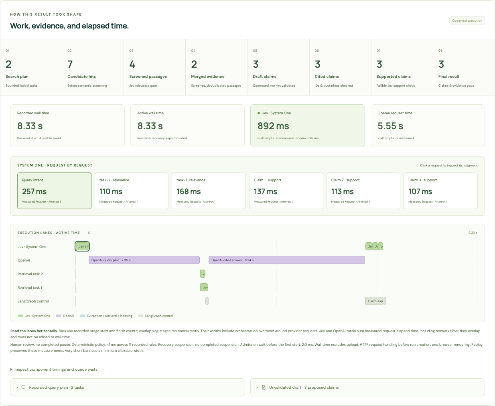

# Document Discovery Studio

An interactive introduction to disaggregated intelligence. **Explore** follows a document through bounded judgment, runtime policy, interpretation, approval, and publication. **Compare** shows how two strategies allocate the same workload. **Experiment** changes a threshold, guard, or document variant while preserving the original recording. Documents and Runs remain available for real work.

The prepared lessons use real execution records with simulated providers. They require no upload or model credentials. Policy experiments evaluate the backend's actual rules without changing operational data or calling a model. New classifications publish accepted documents independently; a real retrieval test verifies that one document is searchable while another worker is still held. See the [education redesign and review](docs/education-redesign-review.md) and [publication contract](docs/independent-publication.md).



This live synthetic comparison recorded six System 1 Model requests with a **125 ms median**. It is one observation, with client/network time included; the [reading guide](docs/reading-a-run.md) explains the measurement boundaries. The [Library](docs/screenshots/library-desktop.png) and [classification workspace](docs/screenshots/run-desktop.png) show document import, three runtime workers, and a saved review pause. The [architecture diagram](docs/diagrams/architecture.svg) explains the component boundaries.

The interactive Project Atlas sample set contains 13 readable documents, including an ambiguous agreement email, conflicting notice periods, an undated invoice, and instruction-like document text. An empty file remains in the repository for failure regression tests. Four additional classification teaching documents demonstrate direct acceptance, uncertainty, and a policy guard overriding high confidence. **Simulated** fixture mode supports a repeatable offline walkthrough. **Live** mode uses real provider adapters and reports integration failures explicitly.

## Start locally

Use Python 3.14.6, uv, and Node 22.23.1. From the repository root:

```sh
uv sync
npm ci --prefix frontend
uv run python -c "from pathlib import Path; p=Path('.env'); p.write_text(Path('.env.example').read_text()) if not p.exists() else None"
uv run doc-discovery init
uv run doc-discovery load-samples
APP_MODE=test-fixture uv run uvicorn doc_discovery.api:app --reload
```

In a second terminal:

```sh
npm run dev --prefix frontend -- --host 127.0.0.1
```

Open `http://127.0.0.1:5173`. For live runs, configure `TYPESAFE_API_KEY` and `OPENAI_API_KEY` in the existing root `.env`, optionally configure LangSmith, and restart the backend with `APP_MODE=live`. Provider secrets remain on the backend. The generated API reference is at `http://127.0.0.1:8000/docs`.

Local API requests use Vite’s `/api` proxy, so an alternate frontend port such as `--port 5175` works without editing CORS. Leave `VITE_API_BASE_URL` blank locally; set `DEV_API_PROXY_TARGET` if the backend runs somewhere other than `http://127.0.0.1:8000`. An explicit `VITE_API_BASE_URL` sends browser requests directly to that API and requires its `CORS_ORIGINS` to include the exact frontend origin. See the [connection diagnosis and regression checks](docs/api-connection-review.md).

The default **Explore → Classify documents** page opens an invoice in **Simulation** mode. Choose an example and press **Run simulation** to follow its prepared document route without making model calls. To measure real models, select **Live models** and press **Run workflow**: the System 1 Model returns a judgment, the runtime applies policy, and the selected frontier model runs only when interpretation is required. Component timings and overall preview elapsed time appear after execution; unavailable measurements stay unavailable. Opening the page or changing an example makes no provider calls.

The **Frontier model** selector offers `gpt-4.1`, `gpt-5.5` (default), and `gpt-5.6-sol`. The selection applies to actual lesson requests and is remembered across scenes; it does not rewrite historical runs or backend configuration. Live classification requires both provider keys so an actual exception can escalate. **Why this route?** exposes the returned decision and policy. The preview stops at an accepted category or unapproved proposal, without creating an operational review or publishing a searchable document. Historical recordings retain their original replay and simulated-provider disclosure.

**Compare latency & quality** runs both classification strategies against the same source and selected frontier model. It reports component times, overall elapsed time, relative latency as a percentage of the frontier baseline, and agreement with the document's authored reference. One synthetic example is not an accuracy benchmark. The separate **Compare** destination also offers recorded-batch and virtual-workload illustrations; its default 80 avoided frontier calls are an assumption, not a provider measurement.

**Find & compare** also starts in Simulation mode. Choose a request and press **Run simulation**, or select **Live models** and **Run Find / Run Compare** to execute real intent, relevance, and support judgments along with any frontier planning or composition selected by the runtime. Code retrieves passages and validates citations. Its **Total service work** bar sums Code, System 1, and Frontier contributions; overlapping parallel requests make this different from elapsed workflow time. **Experiment → Explore a safeguard** replays isolated validation and retry exercises. **Review & redact** starts with its two-strategy prepared simulation and also offers live classification and redaction with the same frontier choices. `/#workflow` remains a compatible entry. Live results never acquire scripted approval or release. See [live request details and limitations](docs/live-lesson-requests.md).

Use **Focus graph** to maximize the canvas and **Escape** to return. The chevron in the bottom dock expands the timeline and details. The continuous speed slider runs from **0.1× to 4×**, starts at **1.0×**, and changes playback only. Dark is the default; the top theme toggle remembers your choice. Select a work node to inspect its state or choose another page from the dock. **Assumptions** explains and edits the modeled timings and per-request costs; these are not benchmarks, provider prices or reliability measurements.

To populate **Runs** with three completed classification lessons, run:

```sh
uv run doc-discovery teaching-runs --cleanup
```

This executes the real classification graph with simulated providers and explicitly simulated human review in an isolated store, then publishes the completed recordings and their searchable synthetic sources. It can run beside the backend, makes no live provider calls, and is safe to repeat. The optional `--cleanup` clears unsuccessful documents and failed/partial runs from the main lists while retaining their sources and history. Active, pending-review, and recoverable inputs are protected.

Open each lesson in **Runs** and choose a **Clear category**, **Uncertain judgment**, or **Policy exception** card above the graph. The replay separates **System 1 judgment → Runtime policy → Accept / Interpret**. **Full workflow** expands review, indexing, and results. Selected routes use thick forward-flowing highlights and numbered papers across classification, discovery, and the Workflow illustration. Visual node waits are compressed; recorded timing and modeled costs keep their original meaning. See the [classification review and verification record](docs/classification-replay-review.md).

For new classification and discovery, open **Documents** and select the January Atlas invoice and ambiguous agreement email. Inspect their separate workers and decisions, complete review, then classify the remaining readable samples. Search `Atlas` with invoice/date filters, compare agreement notice periods, and ask about the absent submarine insurance policy number. The [tutorial](docs/tutorial.md) explains the expected evidence. Live run graphs have the same focus and playback controls; their timing panels use recorded measurements.

## Guides and checks

Read the [guide index](docs/README.md), [architecture](docs/architecture.md), [decision policies](docs/decisions-and-workflows.md), [reading timing and answer formation](docs/reading-a-run.md), [HTTP API](docs/api.md), [Vercel deployment guide](docs/deployment.md), [evaluation](docs/evaluation.md), and [source record](docs/references.md). Editable vector sources and SVGs are in [docs/diagrams](docs/diagrams/README.md). The original brief remains in `notes/`.

```sh
uv run ruff check src tests
uv run pytest
npm run lint --prefix frontend
npm run typecheck --prefix frontend
npm run build --prefix frontend
npm run test:unit --prefix frontend
uv run doc-discovery evaluate
```

`uv run doc-discovery live-smoke` is a separate, opt-in check using the synthetic corpus and real provider accounts. Stop the backend first if it uses the same data directory. [Executed verification](docs/verification.md) distinguishes offline checks, browser inspection, live responses, frontend build compatibility, and deployment.

`npm run test:e2e --prefix frontend` runs browser regressions against isolated fixture services on ports 8001 and 5174. The [frontend review record](docs/frontend-workflow-review.md) describes the visualization checks and the browser limitation in the current sandbox.

This is a local single-user demonstration with one backend process and persistent SQLite storage. FTS5 provides lexical retrieval; there is no embedding search. Scanned PDFs need OCR outside the app. In-process jobs can be interrupted by a restart, while review checkpoints and local replay persist. Put an authenticating access boundary in front of a hosted backend before accepting private uploads. Video comparison remains unverified because the required YouTube content could not be retrieved.
