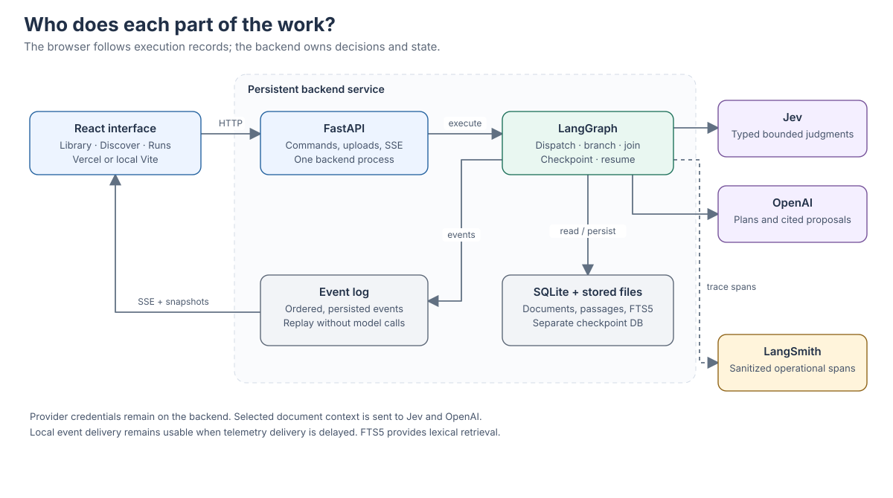

# Architecture

Document Discovery Studio keeps semantic judgments, application rules, and execution records separate. Jev supplies category, intent, relevance, and support signals. Python policy decides whether those signals permit acceptance or require more work. LangGraph schedules the work, including parallel instances and a persistent review pause. OpenAI produces structured proposals, bounded search plans, and cited claims. The browser presents those records as Library, Discover, and Runs views.

Follow the solid arrows for application work. The dashed arrow carries sanitized operational spans to LangSmith; telemetry delivery does not determine the application result.

## One document and one query

When the January Atlas invoice is imported, the backend preserves its filename as display metadata and stores it under a generated identity. Extraction creates passages with document version, section or page, and character offsets. Classification sends bounded document text plus explicit category definitions to Jev. A valid `invoice` result that meets the acceptance policy is accepted, then indexed after the batch joins and any outstanding review is resolved. The run records the input excerpt, provider signal, threshold, policy version, and selected edge so the inspector can explain that transition.

The mixed agreement email follows a different route. A low-confidence result, exact tie, `unknown` label, or explicit ambiguity rule sends it to OpenAI for a proposal. That proposal waits for human review. The original judgment survives any correction. A rejected or unresolved document stays outside the searchable collection.

A query such as “Compare the termination notice periods in the Atlas service agreements” first receives an intent judgment. A bounded OpenAI plan supplies at most three search tasks. LangGraph fans out the actual task list, each worker retrieves lexical candidates and asks Jev about passage relevance, and a keyed join collects every outcome. OpenAI can synthesize only from accepted evidence. Citation identifiers and exact quotations are checked in code, then Jev judges each claim against its cited passages. The output links back to retained passage versions.

## Boundaries and storage

`schemas.py` defines the public Pydantic models. Provider-specific parsing stays in `providers/`; API clients receive typed application records rather than arbitrary graph state. The frontend types are regenerated from the backend contract with `npm run generate:types --prefix frontend`. The command exports Python JSON Schema and runs the checked-in TypeScript generator. `policies.py` owns routing rules and the corresponding inspector explanations. `api.py` owns HTTP commands and event streams, while the workflow engine owns execution.

SQLite application tables retain documents, passages, run metadata, review records, and ordered events. FTS5 indexes only accepted readable documents. LangGraph has a separate SQLite checkpoint database so its persistence schema remains independent of application tables. Stored files and databases live beneath the ignored `APP_DATA_DIR`, which defaults to `.runtime` at the repository root.

FTS5 searches text terms and ranks lexical matches. It does not use embeddings. Bounded query planning can provide alternative phrases, but a passage with no matching indexed term may never reach Jev. A relevance judge cannot recover a passage that retrieval omitted. Measure such misses before adding embeddings or a separate vector database.

Document dates are nullable ISO dates with provenance. A sample date comes from the synthetic manifest; an upload date is user-confirmed metadata. `uploaded_at` records import time separately. Explicit inclusive date filters compare normalized dates in code and SQL, exclude missing dates, and return their excluded count. The unfiltered library retains undated records.

## Execution and the event log

A run-start command returns its ID promptly and schedules a bounded asynchronous job. The browser does not hold that job open. The default worker concurrency is four; the backend runs as one process. LangGraph `Send` creates runtime workers from document IDs or search tasks, and reducers merge terminal results by stable identity. A failed document still contributes a terminal outcome. The parent join checks the entire expected ID set before continuing. These choices follow the [LangGraph Graph API](https://docs.langchain.com/oss/python/langgraph/graph-api).

Events are persisted before they are streamed. Each has a schema version, stable event ID, sequence number within the run, timestamp, instance and parent IDs, attempt number, type, and validated payload. Selected-edge events name both runtime endpoints. Logical event keys suppress repeated lifecycle writes when execution resumes. Recorded decisions and timings remain unchanged during replay.

The implementation validates the installed LangGraph `astream` v2 update envelope and uses explicit lifecycle instrumentation for node starts, decisions, and selected edges. Raw graph state is not forwarded to the browser.

A snapshot contains a consistent `last_event_sequence`. Reload uses that snapshot, then requests later events. SSE supports the `after` cursor and `Last-Event-ID`; heartbeat comments keep idle connections observable. Duplicate events are suppressed by sequence, gaps trigger resynchronization, and streams close after a terminal result or a review pause. Resuming review opens a new stream from the saved cursor. The [sequence diagram](diagrams/api-sse-review.svg) shows how review and reconnection use the same run identity.

A review interrupt checkpoints the parent after all proposals have been collected. The API requires the current interrupt ID, revision, and one decision for every outstanding item. Resume and cancellation commands are serialized per run. LangGraph restarts the interrupted node when it receives `Command(resume=...)`, so uploads and indexing belong outside the code that runs again before the interrupt. See the [interrupt](https://docs.langchain.com/oss/python/langgraph/interrupts) and [persistence](https://docs.langchain.com/oss/python/langgraph/persistence) documentation.

## Restarts, cancellation, and deployment

Awaiting-review runs retain their checkpoint across process restarts. Unfinished in-process jobs are marked interrupted at startup; recovery checks for a compatible checkpoint and matching graph/configuration versions before continuing. Provider execution is not exactly once: a process can stop after a remote call succeeds but before the result is checkpointed. Idempotent application writes and stable event keys limit duplicate local effects. Cancellation is best effort for a call already in flight and prevents subsequent work after it takes effect.

The local scheduler is an in-process task runner, not a durable queue. Use one backend process against a local persistent disk. Multiple web workers, horizontal replicas, rolling deployments during active jobs, and network-mounted SQLite are outside this demo's tested topology. A later shared database and durable job runner would address those needs without changing the public event contract.

The Vite frontend can run on Vercel, with HTTPS uploads and SSE going directly to a separate FastAPI service. The split supports persistent local storage and the job lifecycle. Vercel supports Python and streaming; this choice does not depend on claiming otherwise. [Deployment](deployment.md) gives the exact build settings and backend access boundary.

## Data and telemetry

Provider secrets remain on the backend and are never returned by readiness checks. Normal traces contain IDs, operational summaries, model identifiers, thresholds, and outcomes. Automatic tracing of raw graph state is disabled; direct calls receive explicit sanitized spans. Trace payloads remain metadata-only by default. The explicit `LANGSMITH_TRACE_SYNTHETIC_TEXT=true` option can add at most 14,000 UTF-8 bytes of retained source excerpts to policy spans only when every input reference resolves to a document marked synthetic. It rebuilds that excerpt from retained passages, excluding user query and generated claim text. Private uploads, mixed references, and unresolved identities remain metadata-only. Selected document context still leaves the backend for provider processing. Sanitizing telemetry does not make those model requests local. See [LangSmith input/output filtering](https://docs.langchain.com/langsmith/mask-inputs-outputs).

LangSmith traces correlate graph, provider, retrieval, policy, and review work. A trace link is shown only when a real trace is available; delivery status is recorded separately from the run result. Local event history remains the browser's source of execution truth. The tutorial uses fictional documents so live smoke checks need not send private uploads.

AI Gateway could later provide a shared provider routing and usage layer, and Vercel Connect could provide scoped runtime credentials. Neither is required here. The adapter uses `TYPESAFE_API_KEY` directly; a Gateway adapter would need fresh capability checks, including availability of confidence and distributions. [AI Gateway](https://vercel.com/docs/ai-gateway), [Vercel Connect](https://vercel.com/connect/jev), and the [TypeSafe-compatible Gateway API](https://vercel.com/docs/ai-gateway/sdks-and-apis/typesafe) describe those optional alternatives.
