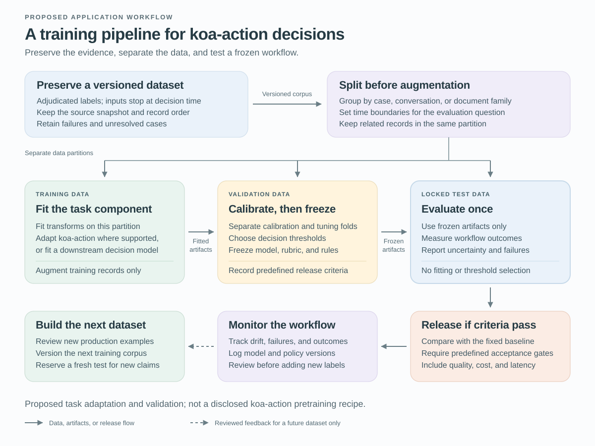

# Building Prod with `koa-action`, Agent Graph and AgentScript

A customer writes, “My invoice looks wrong, and the service has stopped working.” A useful agent has to preserve both requests, establish which account the customer can access, and choose what to handle first. Language interpretation is part of the work; so are business rules and the execution of ordinary software.

That combination gives a fast decision model a practical role. `koa-action`, our System One model, is intended for bounded decisions including classification, noul, scoring, and semantic endpointing. Agent Graph coordinates the Agentforce workflow, while AgentScript configures the state, conditions, and actions that shape its behavior.

[LangChain’s *Building Prod with Jev and LangGraph*](https://www.langchain.com/blog/building-prod-with-jev-and-langgraph) motivates a similar division of work. Here we develop an original Salesforce service example. The integration and training process are proposals: the supplied public sources do not establish a `koa-action` API, fine-tuning interface, or benchmark for this design.

## Start with the decision contract

For our customer’s message, the first decision is which handling route to enter. Define that question before choosing a model. A single route can represent a mixed request without discarding either of its underlying tasks.

| Part of the proposed application contract | Definition |
| --- | --- |
| Evidence | The conversation available so far, with the relevant service context. |
| Allowed routes | `billing`, `technical`, `account_access`, `mixed`, or `unclear`. |
| Mixed request | Preserve both tasks; ask the customer which to address first. |
| Unusable result | A timeout or invalid response takes a bounded fallback; it never selects a business action by default. |

These are application design choices, not `koa-action` response fields. The other capabilities address different questions. A rubric-based score can estimate urgency. Semantic endpointing assesses whether a spoken turn is complete enough to process. For noul, the proposed use is a binary semantic assessment—for example, whether cancellation was requested. TypeSafe uses [Noul](https://docs.typesafe.ai/primitives/noul) for a probability-valued yes/no judgment; its exact semantics and schema are not a verified contract for `koa-action`.

If an integration supplies numerical decision signals, preserve what each means. A proposition probability, an urgency score, and a confidence summary are different quantities. Their decision thresholds need separate validation.

## Follow the request through Agent Graph

A graph connects units of work through allowed transitions. State holds the information those steps share. In this example, state includes the customer’s two requests, the active task, and the trusted account context available to the current session.

Suppose the model returns the proposed `mixed` route. The workflow asks which problem should come first; the customer chooses the invoice. The billing task becomes active, and the outage remains pending. After the system establishes the caller’s access to the selected account, an authorized lookup supplies the invoice facts. A specialist language model can then explain an unfamiliar charge. The workflow marks the explanation delivered only after the required lookup and response steps are recorded; customer confirmation or a defined handoff closes the billing task. It then returns to the pending outage task. A generated claim that the task is finished does not itself satisfy the completion rule.

The distinction between a model result and a transition matters. `mixed` is an interpretation. Preserving two tasks and asking a priority question are configured behavior. The account lookup supplies facts within an already authorized scope; merely finding an account does not authenticate its caller.

Salesforce’s [Agent Graph description](https://engineering.salesforce.com/agentforces-agent-graph-toward-guided-determinism-with-hybrid-reasoning/) explains how explicit state and graph structure support hybrid reasoning. The useful LangGraph comparison is architectural. Agent Graph is a Salesforce-managed Agentforce runtime, not a claim of LangGraph API compatibility.

## Give AgentScript an explicit control job

AgentScript expresses how the Agent Graph workflow combines learned interpretation with programmed rules. This is the neuro-symbolic aspect: neural models process language, while explicit state and conditions govern the permitted process. Guided determinism concerns those authored constraints; model judgments and generated explanations can still be wrong.

In our proposed service flow, AgentScript would specify the mixed-request branch, retain the pending task, and establish the preconditions for the billing path. The [public control-plane article](https://www.salesforce.com/blog/agent-script-control-plane/) describes `available when`, which filters actions offered during model reasoning. An available action may still go unselected. A mandatory precheck belongs in deterministic procedure logic before the relevant business action, and the transaction service must enforce authorization itself.

If the customer later requests a credit, the service performing that write must check the caller, account, and current eligibility. Account identifiers used for consequential actions should be bound from trusted application state rather than accepted from model extraction. A high-scoring “credit requested” judgment cannot supply any of these permissions.

The [open Agent Script repository](https://github.com/salesforce/agentscript) contains language tooling; execution remains in Salesforce’s managed runtime. This makes the authoring boundary concrete without requiring an invented SDK example.

## Preserve the evidence before training

The learning problem begins with the next-route contract. Reviewers should label the route justified by the evidence available at that decision, including `mixed` and `unclear`, and adjudicate disagreements. A label for the customer’s eventual resolution answers a different question from a label for the appropriate next step.

Freeze a versioned source snapshot with record identifiers, turn order, timestamps, and case relationships. For each example, reconstruct only the conversation prefix and trusted account-state snapshot available at the decision time. Subsequent turns and outcomes may support a separate outcome label; they must not enter the earlier model input. Reviewers labeling the appropriate next route should see the same decision-time evidence as the model.

This distinction is especially important for semantic endpointing. A recording’s future speech reveals whether the customer continued, so it can supply the target label while remaining excluded from the prefix being judged. Measure premature cutoffs and delay after a true turn ending separately. Keep every prefix from a conversation in the same partition.

*Figure 1. Proposed task adaptation and evaluation for `koa-action` decisions. Training data fits supported components; validation selects calibration and routing rules; the locked test evaluates the frozen workflow. Reviewed production feedback enters a future dataset. This is an application-development design, not a disclosed `koa-action` pretraining process.*

Split related cases into training, validation, and test groups before creating paraphrases or other variants. Check for duplicates across boundaries, and keep derived examples with their source. If the claim concerns unseen accounts, group by account; if it concerns future traffic, reserve a later-time cohort and prevent related records from leaking across that boundary. Record any exclusions so the evaluated population is clear.

Preserving the dataset means retaining the source records and their structure, with a manifest linking every derived example to its origin and partition. Redaction, filtering, and resampling can change what the model sees; record those changes and report their counts. We cannot claim that training leaves the dataset’s exact distribution unchanged.

Fit learned preprocessing and any supported adaptation on training data only. If `koa-action` cannot be adapted, omit that step and evaluate the fixed model with application-level configuration. Keep calibration fitting separate from threshold selection within the development data, then freeze the model, decision definitions, preprocessing, and routing policy. Test cases have no role in choosing any of them.

## Decide what would count as an improvement

Before looking at the test, declare a maximum tolerable increase in the chosen error rate and an operational target. The null hypothesis is that quality loss reaches that margin or that the candidate does not reduce handling latency. Rejecting this null requires both acceptable quality and a latency benefit; a nonsignificant quality difference is insufficient.

Compare the candidate with a general-purpose model answering the same next-route question on the same held-out cases. Hold graph structure, authoritative facts, and available actions fixed. Each model’s numerical gates must be selected independently on development data under the same quality constraints, because their signal scales may differ.

Measure the routing decision and the complete workflow separately. The latter should include incorrect outcomes and cases unresolved within a predefined service window. Report automated coverage alongside errors among automatically handled cases, plus total cost and latency including fallbacks, retries, and review. Otherwise, escalating difficult requests can masquerade as higher quality or lower cost.

Use paired comparisons on the same cases, with uncertainty estimated at the independent case or account-group level. Choose the sample size and confidence bounds before testing, taking rare consequential errors into account. Repeated calls on the same conversation measure repeatability; they do not increase the number of independent customer situations. If the quality bound remains too wide to rule out unacceptable loss, the result is inconclusive and the candidate has not earned release.

## Follow uncertainty through production

Where the integration exposes confidence, evaluate its relationship to correctness on local cases. A concentrated output distribution can still support a wrong classification. Measure errors among automatically routed cases at different levels of coverage—the fraction handled without escalation—then choose the operating point on validation data.

An offline judge can help review traces, but the judge should also be compared with human references. [LangChain’s Jev evaluation articles](https://www.langchain.com/blog/jev-agent-evals-langsmith) make repeatability an interesting measurement; repeatability alone cannot establish correctness for a new task or a different model.

Consider three illustrative outcomes. A clear invoice question reaches billing and produces an authorized explanation. A mixed request reaches clarification and takes longer, preserving the information needed for the next decision. A wrongly routed request exposes a gap in the taxonomy or training examples and becomes a candidate for the next development cycle. These examples describe what to test, rather than results from a deployed Salesforce system.

The first implementation should focus on one decision with an observable consequence. Define its contract, represent the surrounding workflow in Agent Graph, configure its controls with AgentScript, and evaluate the complete path. Expansion becomes defensible when the team can explain the remaining errors and show that the new decision step improves the service outcome under the chosen constraints.
