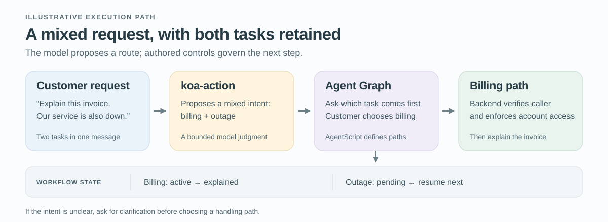

# Building Prod with `koa-action`, Agent Graph and AgentScript

A customer writes, “My invoice looks wrong, and the service has stopped working.” A useful agent has to preserve both requests, establish which account the customer can access, and choose what to handle first. Language interpretation is part of the work; so are business rules and the execution of ordinary software.

Our hypothesis is that a specialized routing decision can shorten the path to resolution while preserving both requests and meeting the same service-quality requirements. That gives a fast decision model a practical role. `koa-action`, our System One model, is intended for bounded decisions including classification, noul, scoring, and semantic endpointing. Agent Graph coordinates the Agentforce workflow, while AgentScript configures the state, conditions, and actions that shape its behavior.

[LangChain’s *Building Prod with Jev and LangGraph*](https://www.langchain.com/blog/building-prod-with-jev-and-langgraph) motivates a similar division of work. Here we develop an original Salesforce service example. The integration and training process are proposals: the supplied public sources do not establish a `koa-action` API, fine-tuning interface, or benchmark for this design.

## Start with the decision contract

For our customer’s message, the first decision is which handling route to enter. Define that question before choosing a model. A single route can represent a mixed request without discarding either of its underlying tasks.

| Part of the proposed application contract | Definition |
| --- | --- |
| Evidence | The conversation available so far, with the relevant service context. |
| Allowed routes | `billing`, `technical`, `account_access`, `mixed`, or `unclear`. |
| Mixed request | Preserve both tasks; ask the customer which to address first. |
| Unusable result | A timeout or invalid response enters a configured fallback; it never selects a business action by default. |
| Clarification limit | After a predefined turn or time budget, offer a human handoff and retain unresolved tasks. |

These are application design choices, not `koa-action` response fields. Other capabilities fit adjacent moments in the same journey. In a voice channel, semantic endpointing assesses whether the customer has finished the turn before routing begins. A rubric-based score could distinguish an inconvenience from a complete service outage. If the customer adds “cancel my service,” noul could assess that binary request. TypeSafe uses [Noul](https://docs.typesafe.ai/primitives/noul) for a probability-valued yes/no judgment; its exact semantics and schema are not a verified contract for `koa-action`. We will evaluate next-route classification first, so the effect of changing several decisions at once does not obscure the result.

If an integration supplies numerical decision signals, preserve what each means. A proposition probability, an urgency score, and a confidence summary are different quantities. Their decision thresholds need separate validation.

## Follow the request through Agent Graph

A graph connects units of work through allowed transitions. State holds the information those steps share. In this example, state includes the customer’s two requests, the active task, and the trusted account context available to the current session.

Suppose the model returns the proposed `mixed` route. The workflow asks which problem should come first; the customer chooses the invoice. The billing task becomes active, and the outage remains pending. After the system establishes the caller’s access to the selected account, an authorized lookup supplies the invoice facts. A specialist language model can then explain an unfamiliar charge. The workflow records that the explanation was delivered, then waits for the configured resolution criterion, such as customer confirmation. An accepted handoff is recorded separately from resolution, with the receiving queue and outstanding work retained. The outage stays pending until addressed or explicitly reprioritized; the system does not count a generated claim of completion as a completed task.

*Figure 1. A proposed path for the mixed request. Model interpretation supplies the route; configured workflow behavior retains the tasks, and trusted services establish account access. The pending outage remains visible after the invoice explanation.*

The distinction between a model result and a transition matters. `mixed` is an interpretation. Preserving two tasks and asking a priority question are configured behavior. The account lookup supplies facts within an already authorized scope; merely finding an account does not authenticate its caller.

Salesforce’s [Agent Graph description](https://engineering.salesforce.com/agentforces-agent-graph-toward-guided-determinism-with-hybrid-reasoning/) explains how explicit state and graph structure support hybrid reasoning. The useful LangGraph comparison is architectural. Agent Graph is a Salesforce-managed Agentforce runtime, not a claim of LangGraph API compatibility.

## Give AgentScript an explicit control job

AgentScript expresses how the Agent Graph workflow combines learned interpretation with programmed rules. This is the neuro-symbolic aspect: neural models process language, while explicit state and conditions govern the permitted process. Guided determinism concerns those authored constraints; model judgments and generated explanations can still be wrong.

In our proposed service flow, AgentScript would specify the mixed-request branch, retain the pending task, and establish the preconditions for the billing path. The [public control-plane article](https://www.salesforce.com/blog/agent-script-control-plane/) describes `available when`, which filters actions offered during model reasoning. An available action may still go unselected. A mandatory precheck belongs in deterministic procedure logic before the relevant business action, and the transaction service must enforce authorization itself.

If the customer later requests a credit, the service performing that write must check the caller, account, and current eligibility. Account identifiers used for consequential actions should be bound from trusted application state rather than accepted from model extraction. A high-scoring “credit requested” judgment cannot supply any of these permissions.

The [open Agent Script repository](https://github.com/salesforce/agentscript) contains language tooling; execution remains in Salesforce’s managed runtime. This makes the authoring boundary concrete without requiring an invented SDK example.

## Preserve the evidence before training

Label the next route justified by the conversation so far, including `mixed` and `unclear`, and adjudicate reviewer disagreements. Preserve a versioned source snapshot with record identifiers, turn order, timestamps, and case relationships. Every model input must stop at the decision time, using only the conversation prefix and trusted account facts then available. Reviewers labeling the appropriate next route see the same evidence. Later events may support a separate outcome label, but cannot enter that earlier input.

For semantic endpointing, future audio can establish when the turn actually ended while remaining excluded from the prefix being evaluated. All prefixes from a conversation stay together. Premature cutoffs and delay after the true ending require separate measurements; the routing experiment cannot establish endpointing quality.

*Figure 2. Proposed task adaptation and evaluation for `koa-action` decisions. Training data fits supported components; validation selects calibration and routing rules; the locked test evaluates the frozen workflow. Reviewed production feedback enters a future dataset. This is an application-development design, not a disclosed `koa-action` pretraining process.*

Group duplicate and related cases before assigning training, validation, and test partitions; generated variants inherit their source’s partition. Use account groups for an unseen-account claim, or a later-time cohort for a future-traffic claim, documenting how related records and exclusions are handled. Retain the original records and a manifest linking each derived example to its source. Record changes from redaction, filtering, and sampling, because preserving provenance does not imply an unchanged distribution.

Fit learned preprocessing and any supported model adaptation on training data. If direct `koa-action` adaptation is unavailable, omit it and develop the fixed model’s application configuration. Within development data, separate calibration fitting from threshold selection. Freeze the resulting model, definitions, transformations, and routing policy before opening the test. Production feedback belongs to a later dataset; tuning against it requires fresh untouched evidence for the next performance claim.

## Decide what would count as an improvement

For this example, define workflow quality as the fraction of attempted cases with an incorrect outcome or any requested task unresolved at the end of a fixed service window. Both the billing request and outage count. Track consequential mistakes, such as an unauthorized credit, separately within all cases that reach the corresponding action opportunity. An aggregate service metric must not hide those failures.

Specify a maximum tolerable increase in the case-failure rate and a minimum worthwhile latency improvement before testing. The null hypothesis is that quality loss reaches the allowed margin or the latency benefit falls short of the required gain. Release needs uncertainty bounds supporting both requirements. Failure to detect a quality difference is insufficient, and rare-action safety gates may still block a candidate that passes the overall comparison.

First compare `koa-action` with a general-purpose model answering the same next-route question on the same held-out snapshots. Hold graph structure, authoritative facts, and available actions fixed. Select each model’s numerical gates on development data under the same quality constraints; their signal scales may differ. This paired replay estimates decision quality and client-observed decision latency, including retries. It cannot measure how real customers or review queues respond to changed routes.

Then assess the complete workflow in a separately controlled service pilot. Define its latency clock from intake to resolution within the service window, keep unresolved cases in the outcome report, and include waits, retries, fallback calls, and human work. Comparing only completed cases can favor a system that abandons difficult ones. Choose a time-to-resolution analysis that accounts for unresolved cases; record total cost per attempted case and the fraction completed by the deadline as complementary measures.

Report automatic coverage alongside error among automatically handled cases. Estimate uncertainty at the independent case or account-group level, with the sample size and confidence procedure chosen before opening the test. Repeated calls on the same conversation measure repeatability; they do not create independent customer situations. If the bounds cannot rule out unacceptable loss, the result is inconclusive and the candidate has not earned release.

## Use failures to find the right correction

Suppose the invoice is explained, but the outage disappears from the conversation. The trace should show the input snapshot, returned route, applicable policy version, and resulting task state. If `koa-action` returned `billing`, investigate the mixed-request definition and the context it received. If it returned `mixed` and the workflow still dropped the outage, investigate the state update and transition logic. Retraining the classifier would not repair that second defect.

The same trace discipline applies to uncertainty. Where numerical confidence is available, test its relationship to correctness on local data before selecting a gate. [TypeSafe’s confidence documentation](https://docs.typesafe.ai/confidence) distinguishes distribution concentration from demonstrated accuracy. A model can be consistently confident about the wrong route.

Offline semantic judges can help find traces worth investigating. The [LangSmith evaluation integration](https://www.langchain.com/blog/jev-is-now-available-in-langsmith-evals) illustrates that role, while the [Jev judge study](https://www.langchain.com/blog/jev-agent-evals-langsmith) separates repeatability from agreement with human references. An evaluator needs its own validation; a post-run score cannot prevent an action that already happened.

Sample apparently successful automated cases as well as escalations, and have reviewers establish new labels rather than copying prior model decisions. A clean-looking completion may conceal the dropped outage that motivated this design. These are constructed diagnostic examples, not reported Salesforce results.

Start with the next-route decision and ask whether the evaluated candidate meets the declared quality and latency criteria. If it does, the team has evidence for expanding the design to another bounded judgment. If it does not, the recorded decision and workflow state identify which part of the service path needs the next experiment.
