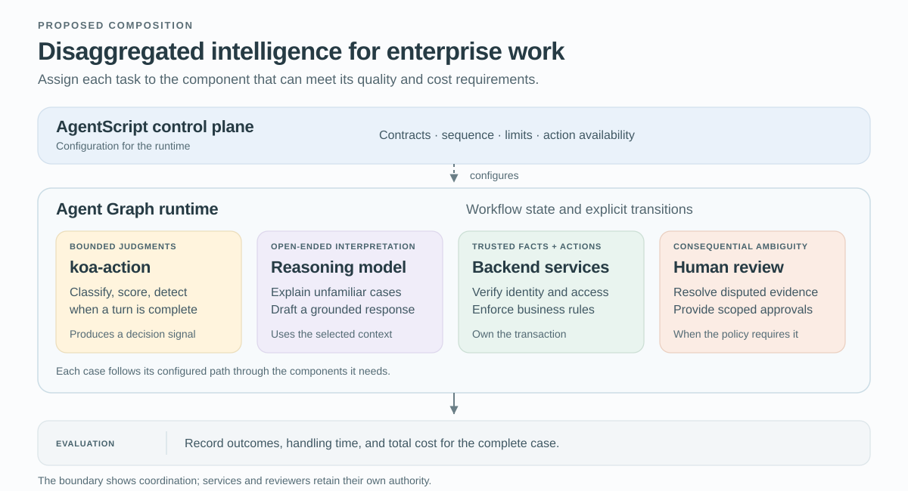

# Building Prod with `koa-action`, Agent Graph and AgentScript

A customer asks an enterprise agent to explain an unexpected invoice charge and investigate a service outage. The agent must interpret the request, retrieve authorized account information, explain what happened, and keep both tasks moving. Routing every part of that process through a general-purpose reasoning model consumes expensive capacity on decisions that often have a small set of possible answers. It also makes business controls harder to inspect when their execution depends on model interpretation.

The architectural response is **disaggregated intelligence**: separate the kinds of work inside an agent and assign each to a component with an explicit contract. A fast model can classify the request. A generative model can explain the invoice. Software can enforce account access and track unresolved work. This allocation is central to building enterprise agents whose reliability and cost can be managed together.

`koa-action`, our System One model, supplies bounded judgments. Agent Graph provides the managed Agentforce runtime that coordinates the workflow. AgentScript configures how learned reasoning interacts with programmed control. Together, they offer a way to make the allocation of intelligence an explicit engineering decision.

[LangChain’s *Building Prod with Jev and LangGraph*](https://www.langchain.com/blog/building-prod-with-jev-and-langgraph) provides the starting point for this discussion. We develop an original Salesforce design around its broader specialization argument. The composition below is proposed: the supplied public references do not establish a `koa-action` API, training interface, or measured savings for this integration.

## Allocate reasoning where the task needs it

Disaggregation begins with the work, rather than the number of models. Ask what uncertainty a step must resolve and what kind of result the next step needs. A known account balance calls for an authorized lookup. An unfamiliar invoice dispute may require extended reasoning. Selecting the next service route can often be formulated as a bounded classification.

| Responsibility | Component in the proposed design | Contract to make explicit |
| --- | --- | --- |
| Bounded semantic judgment | `koa-action` | Question, available evidence, allowed result, and uncertainty handling. |
| Open-ended interpretation and explanation | A generative reasoning model | Relevant context, permitted tools, and required evidence for the answer. |
| Workflow execution | Agent Graph | Shared state, allowed transitions, and recorded task status. |
| Authored reasoning controls | AgentScript | Conditions, required procedures, action availability, and bound inputs. |
| Authoritative facts and business actions | Permissioned application services | Caller access, current policy, and the transaction’s actual outcome. |

A human review path belongs wherever the application requires human judgment or the automated process cannot resolve the case within its limits. Splitting a system into more components does not establish reliability by itself. The boundaries help only when their inputs, outputs, and failure behavior are clear enough to test.

*Figure 1. A proposed allocation of enterprise reasoning. AgentScript defines the controls used by Agent Graph; each case invokes the components its workflow requires. No native `koa-action` adapter or measured performance is implied.*

The other `koa-action` capabilities fit the same principle. Scoring can evaluate urgency against a defined rubric. Semantic endpointing can assess whether a spoken turn is complete enough to process. Noul can serve a binary semantic question, such as whether the customer requested cancellation. TypeSafe documents [Noul](https://docs.typesafe.ai/primitives/noul) as a probability-valued yes/no judgment; the corresponding `koa-action` schema and calibration behavior remain unspecified in these sources. An urgency score, a proposition estimate, and a confidence summary need distinct interpretations and separately evaluated gates.

## Follow the customer through the boundaries

For our service example, define the next-route choices as `billing`, `technical`, `account_access`, `mixed`, and `unclear`. Those are proposed application labels. The classifier receives only the conversation available so far and the context needed to interpret it. It receives no authority to issue a credit or change account access.

Suppose it returns `mixed`. Agent Graph retains both tasks and follows the configured clarification step. The customer chooses billing first. After a trusted service establishes the caller’s access to the account, an authorized lookup retrieves the invoice facts. A generative model explains the charge using that evidence. The outage remains pending until the workflow returns to it or the customer explicitly changes priorities.

The system records an explanation delivered separately from a task resolved. A resolution criterion might require customer confirmation; an accepted human handoff records the receiving queue and outstanding work without counting the request as resolved. Clarification also needs a turn or time budget, with a defined handoff when that budget expires.

This example shows why enterprise reasoning needs a control structure around model calls. Salesforce’s [Agent Graph account](https://engineering.salesforce.com/agentforces-agent-graph-toward-guided-determinism-with-hybrid-reasoning/) describes explicit state and graph topology as foundations for hybrid reasoning. The LangGraph comparison is architectural: Agent Graph is Salesforce’s managed runtime, with its own contracts.

## Configure guided determinism with AgentScript

Neuro-symbolic reasoning combines neural interpretation of language with explicit software state and rules. AgentScript provides the authoring layer for that combination in Agent Graph. Guided determinism means the workflow constrains where uncertain judgments can affect execution; it does not make a classification infallible.

The [Agent Script control-plane article](https://www.salesforce.com/blog/agent-script-control-plane/) describes `available when`, which controls actions offered during model reasoning, and argument bindings that constrain their inputs. In our example, a mandatory account-access check should run in deterministic procedure logic. An availability condition alone does not ensure that the model selects a required action or completes the task.

If the customer requests a credit, the service performing the transaction rechecks the caller, account, and eligibility. Consequential account identifiers come from trusted application state. Salesforce’s [enterprise-agent engineering discussion](https://engineering.salesforce.com/building-enterprise-ai-agents-that-are-both-autonomous-and-reliable/) similarly separates probabilistic interpretation from controlled business operations. The [open Agent Script repository](https://github.com/salesforce/agentscript) supplies language tooling; it does not contain the managed execution runtime.

These boundaries also define the failure path. An invalid classifier response or timeout should enter a configured fallback, rather than selecting a business action by default. Repeated transaction attempts require safeguards in the service performing the write. Workflow control can preserve a decision without guaranteeing that an external side effect happens only once.

## Account for the whole service path

The cost argument for disaggregated intelligence is conditional: avoided expensive work must exceed the overhead added by specialized decisions and their orchestration. A classifier offers little economic benefit if almost every request immediately invokes the same large model anyway. A poorly chosen uncertainty gate can also move the expense into retries or human review.

For each attempted case, count the decision calls, generative calls, tool and runtime usage, retries, and human handling. Measure human time and state the costing assumptions. Report total cost alongside resolution rate and automated coverage, the fraction handled without escalation. A lower invoice from a model provider is insufficient evidence if more customer requests remain unresolved.

This suggests a practical starting point: choose a frequent bounded decision that actually changes the downstream work. Keep open-ended reasoning available for cases that need it, and evaluate the gate under the same service requirements as the baseline. Latency remains a service constraint; it is not a substitute for measuring cost.

## Train and test without losing the evidence

The first experiment changes next-route classification only. Reviewers label the route justified by the evidence available at that decision, including mixed or unclear requests, and adjudicate disagreements. Preserve a versioned source snapshot with record order, timestamps, case relationships, and a manifest linking derived examples to their origins.

Every input must stop at the decision time. Later turns or case outcomes may support a separate outcome label but cannot enter the earlier model input. For semantic endpointing, the same principle excludes future audio from the prefix being evaluated, even when that audio establishes the target label.

*Figure 2. Proposed task development and validation. Retain the source snapshot and decision-time inputs, split related records before augmentation, fit permitted components on training data, and select gates on development data. The locked test receives frozen artifacts. This diagram does not describe `koa-action` pretraining.*

Group related and duplicate cases before assigning partitions, and keep generated variants with their sources. Use account groups for an unseen-account claim or a later-time cohort for a future-traffic claim, documenting boundary exclusions. Preserve the records and their relationships while recording changes introduced by redaction, filtering, or resampling; those transformations can change the observed distribution.

Fit learned preprocessing and any supported adaptation on training data. If direct `koa-action` adaptation is unavailable, omit it and develop the fixed model’s application configuration. Separate calibration fitting from threshold selection within development data, then freeze the model, decision definitions, transformations, and workflow policy. Reviewed production feedback enters a later dataset; a new performance claim after tuning needs fresh untouched evidence.

## Test reliability and cost together

Define a failed case as one with an incorrect outcome or any requested task unresolved at the end of a fixed service window. Both the invoice and outage count. Track consequential errors, such as an unauthorized credit, separately across cases reaching the relevant action opportunity.

Before testing, declare the maximum tolerable increase in the case-failure rate and the minimum worthwhile reduction in mean total cost per attempted case. The joint null hypothesis is that quality loss reaches the allowed margin or cost savings fall short of the required gain. Acceptance requires uncertainty bounds supporting both criteria, plus the separate consequential-error and latency limits. Failing to detect a quality difference does not establish acceptable equivalence.

A paired offline comparison can first test `koa-action` against a general-purpose model answering the same next-route question on the same held-out snapshots. Keep graph structure, authorized facts, and available actions fixed, with each model’s numerical gates chosen separately on development data under the same quality constraints. Measure decision errors and client-observed call cost and latency, including retries.

The full economic claim requires a controlled service pilot: replay cannot reveal how changed routes affect real customers or review queues. Assign comparable traffic to the candidate and baseline, avoid mixing treatments within a case, and count every attempted case, including failures and escalations. Record total costs over the declared service window, resolution by its deadline, and time-to-resolution accounting for unfinished cases. Choose the sample size and uncertainty method before testing, using independent case or account groups. Repeated calls on one conversation measure repeatability, not new customer situations.

No comparative results are reported here. If the data cannot exclude unacceptable quality loss or establish the required saving, the proposed allocation has not earned a broader rollout.

## Let failures identify the next change

Suppose the invoice is explained but the outage disappears. If the recorded classification was `billing`, inspect the model’s input and mixed-request definition. If it was `mixed`, inspect the workflow transition that dropped the pending task. The first finding may motivate better decision data; the second points to an AgentScript configuration change. Preserve the failing case and replay the corrected path before another evaluation.

Where confidence is available, validate its relationship to correctness locally; [distribution concentration alone is insufficient](https://docs.typesafe.ai/confidence). Offline judges can help prioritize traces, as illustrated by [LangSmith’s evaluator integration](https://www.langchain.com/blog/jev-is-now-available-in-langsmith-evals), but [repeatable judging does not establish correctness](https://www.langchain.com/blog/jev-agent-evals-langsmith). Review samples of apparent automated successes as well as escalations, using independently adjudicated labels. A post-run score cannot protect an action that has already occurred.

Disaggregated intelligence makes the allocation of reasoning inspectable and revisable. `koa-action` can supply a focused judgment; AgentScript and Agent Graph can give that judgment a controlled place in the service process. The engineering test is whether this allocation completes the customer’s work within the required reliability and cost limits. The invoice explanation and the still-pending outage give that test a concrete meaning.
