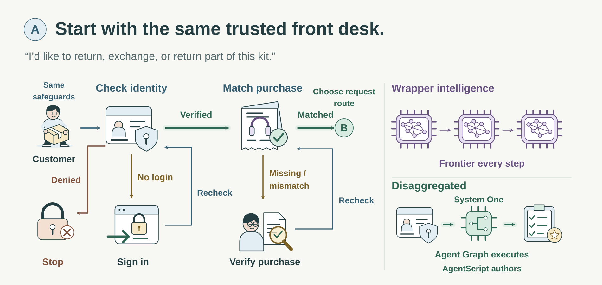
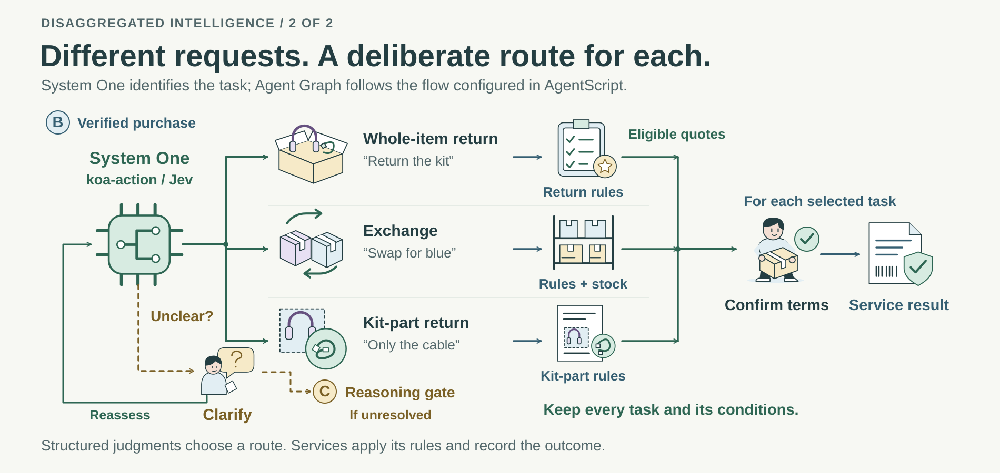
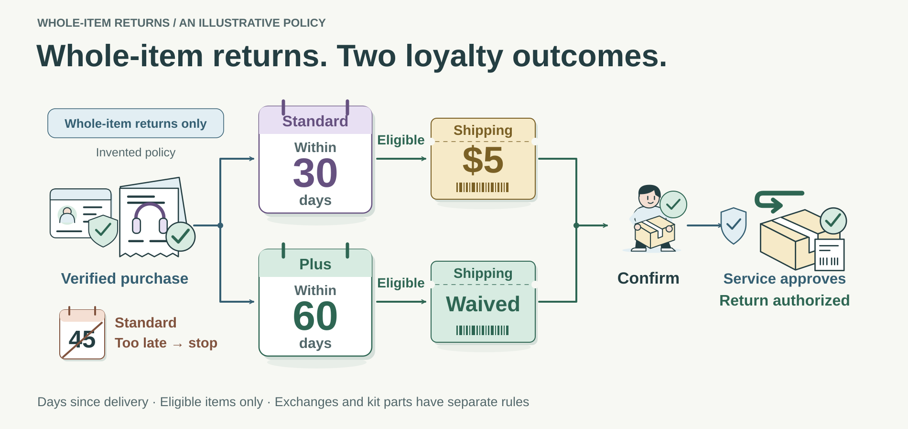
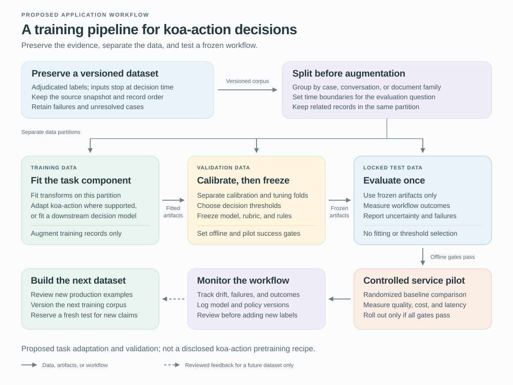

# Building Prod with `koa-action`, Agent Graph and AgentScript

An Agentforce agent needs to finish a customer’s work reliably, with predictable business controls and a response time the service can sustain. Consider a customer who says, “Exchange these headphones and return the spare cable.” The purchase records show that the cable was bought separately. These are two familiar requests with different business consequences. A frontier LLM—a leading general-purpose language model—can interpret them, but repeatedly invoking it to choose every next step spends expensive reasoning on work that often fits focused decisions and established software procedures.

**Disaggregated intelligence** allocates those different kinds of work explicitly. Known facts and calculations come from application services and code. A specialized model supplies a bounded semantic judgment that software can act on, while frontier reasoning remains available for difficult interpretation. The objective is to use the least expensive component that meets the decision’s quality requirements and fits the service’s latency budget, then verify the economics of the complete workflow.

In the proposed Salesforce design here, `koa-action` is the **System One model**: it takes focused judgment out of the frontier model’s broader job and supplies structured decisions, such as defined request categories. Jev illustrates the same model role in the TypeSafe ecosystem. Agent Graph is the managed Agentforce runtime that coordinates these components, preserves state, and follows the configured routes and escalation gates. AgentScript is the language used to author those controls. Together they determine what runs, in what order, and with which evidence.

[LangChain’s *Building Prod with Jev and LangGraph*](https://www.langchain.com/blog/building-prod-with-jev-and-langgraph) attributes the unbundling argument to Jaya Gupta and advocates “cheap by default, frontier on exception.” [TypeSafe’s manifesto](https://typesafe.ai/manifesto) develops the complementary idea of composable semantic judgments. The principle retains the frontier model and gives it a more selective role. The retail workflow below is an original teaching design; the supplied sources do not establish a native `koa-action` adapter, its training interface, or measured savings for this composition.

## Begin with the same service authority

Our comparison holds the business requirements fixed. In the illustrated wrapper architecture, a frontier model repeatedly proposes the next action using the conversation and service results accumulated so far. In the disaggregated architecture, authored graph transitions coordinate known dependencies and a smaller decision model interprets the customer’s request. Both rely on the same authoritative identity and purchase services.

*Figure 1. The two architectures share the same entrance requirements. A successful identity-service result permits purchase lookup; sign-in returns to that check. A model cannot turn a failed check into permission. [Open the full-size illustration](../diagrams/returns-comparison-access.svg).*

The identity service supplies an observable result. **Verified** means the graph can use the established principal and permissions. A **missing or expired session** leads to secure sign-in, then back to the identity check. Saying “I signed in” or completing a screen is insufficient; the service must confirm success. **Rejected or failed verification** stops protected work and offers the permitted account-support route. An **unavailable or invalid service result** remains pending while bounded recovery or support handles the problem.

After verification, the order service binds the receipt to that customer and retrieves relevant purchased items, delivery facts, quantities, and kit composition. A missing identifier calls for the needed input. Ownership mismatch goes to verification or hold. Neither outcome requires frontier interpretation around the failed check. Salesforce’s [enterprise-agent account](https://engineering.salesforce.com/building-enterprise-ai-agents-that-are-both-autonomous-and-reliable/) describes this structural separation between verification and subsequent transactional work.

An owned order may contain several products. “Return part of my order” could mean a complete item from that order or a component removed from a kit. When the reference is ambiguous, the workflow asks which purchased unit the customer means before its handler can act.

## Let System One identify familiar requests

The semantic work now has a useful boundary. Given the conversation so far and the relevant authorized item facts, the decision model identifies what the customer is asking to do and which purchased unit is affected. Agent Graph maps those judgments to configured service handlers. This is where specialization can remove a frontier call from familiar work without removing language interpretation from the application.

*Figure 2. These are examples of familiar action-and-scope combinations. An exchange or kit-component request can follow a known service route without frontier reasoning. Selecting a route does not establish eligibility. [Open the full-size routing illustration](../diagrams/returns-comparison-routing.svg).*

Keep three questions separate when designing the decision contract:

| Question | Proposed application meaning |
| --- | --- |
| What action is requested? | A return for refund, an exchange, another request, or an action needing clarification. |
| What purchased unit is affected? | A complete product or a component of a kit, tied to a verified candidate item. An unresolved reference stays unresolved. |
| How clear is the interpretation? | Clear under the authored definitions, needing clarification, or still difficult to interpret after clarification. |

These are conceptual application distinctions, not a claimed provider response schema. [TypeSafe’s construction guide](https://docs.typesafe.ai/concepts/how-to-build-with-system-one) advocates narrow questions with relevant context and explicit software composition; its [structured-criteria guide](https://docs.typesafe.ai/primitives/advanced) shows how category definitions can make boundaries clearer. Jev’s particular APIs and batching behavior do not become `koa-action` capabilities by analogy.

The picture shows three configured combinations: return the whole purchased kit, exchange a complete item, and return a kit component. Here, *whole-item return* means the complete purchased product, including its kit contents where applicable; it need not mean every item in the order. A cable purchased separately is a complete product. The same kind of cable included inside a headphone kit has component scope.

An exchange of a kit component is also meaningful. The graph dispatches that combination if a supported handler is configured; otherwise it preserves the request for configured specialist handling. It does not turn the request into two actions or invent an available service. Every handler must obtain its own applicable rules and facts. Unknown component policy or replacement inventory requires a service lookup, verification, or hold.

Classification is the capability illustrated here. Other focused decisions may use scoring against a written rating guide, semantic endpointing to assess whether a spoken turn is complete, or noul for a yes/no question. [TypeSafe documents Noul’s numerical meaning](https://docs.typesafe.ai/primitives/noul) for Jev; the corresponding `koa-action` schema and calibration behavior remain unspecified in the supplied sources.

## Preserve everything the customer requested

The graph’s state records what is known and what work remains. It retains each proposed task, its item or component reference, its status, and its relationship to other tasks. A model’s proposed task list does not authorize every listed action to execute.

“Exchange these headphones **and** return the spare cable” contains two obligations. In our example, the cable is a separate purchased item, so its return takes the whole-item handler. Each task receives its own policy result and confirmation. Finishing one cannot erase the other, and a justified denial of one need not prevent the other from proceeding. An **or** choice preserves alternatives until the customer selects one or supplies a clear condition.

“Exchange these for white **if** white is in stock; otherwise return them” provides such a condition. The graph obtains stock status from the exchange service and follows the stated preference in code. An unknown stock result waits for verification; it cannot activate the out-of-stock branch. A different exchange-policy rejection does not silently broaden the customer’s condition. The selected action still requires its own eligibility checks and accepted terms. Only the selected alternative may commit.

A clear conditional request can therefore remain on the authored path. The number of products or business steps does not determine whether sophisticated interpretation is needed.

## Give each node a controlled view of the work

Each step sees the evidence relevant to its job and can establish a limited kind of result. The identity service establishes access. The order service establishes ownership and candidate items. The semantic node proposes task meanings using that authorized context. A handler evaluates its own rules, and the writing service records the actual transaction outcome. Trusted facts remain separate from model proposals.

This is how procedural domain knowledge enters graph topology—the arrangement of nodes and transitions. The structure specifies which checks must precede action, how task relationships affect execution, and what context reaches each model. Live purchase facts stay in application records, and policy remains versioned business logic. Salesforce’s [Agent Graph account](https://engineering.salesforce.com/agentforces-agent-graph-toward-guided-determinism-with-hybrid-reasoning/) describes this separation between topology and each node’s capabilities. Its relationship to LangGraph is an architectural analogy, with distinct runtime contracts.

AgentScript provides the authoring layer for this **neuro-symbolic** arrangement: learned language interpretation operating within explicit software state and rules. The [AgentScript control-plane article](https://www.salesforce.com/blog/agent-script-control-plane/) describes typed state, bound action inputs, and `available when` conditions that filter actions offered during model reasoning. In this design, mandatory verification and policy procedures execute through authored control logic. Making an action available does not ensure its execution or completion.

Consequential identifiers and entitlements come from trusted service outputs, with writes to those fields restricted accordingly. The backend rechecks its requirements when committing. AgentScript’s [open repository](https://github.com/salesforce/agentscript) supplies language tooling; the managed runtime is separate. Guided determinism describes control over where uncertain judgments affect execution, while classification accuracy remains an empirical property.

## Apply the policy for the selected handler

The familiar routes end at business services, each responsible for different rules. An exchange service checks the requested replacement, availability, allowed quantities, and its applicable terms. A component service checks the kit relationship, supported remedy, quantities, and component-specific rules. Recognizing a cable-return request does not establish that the merchant permits splitting the kit or offers a prorated refund.

For **whole-item returns only**, use this invented merchant policy:

| Verified loyalty tier | Request received after delivery | Shipping for an eligible whole-item return |
| --- | --- | --- |
| Standard | Within 30 days, inclusive. | Customer pays $5. |
| Plus | Within 60 days, inclusive. | Waived. |

Both tiers require a returnable whole item and sufficient unreturned quantity. Membership comes from an authorized service. Missing or contradictory required facts, an unknown tier, or a required manual assessment leave the case pending. Exchange and component handlers obtain their own terms; this table supplies none of their deadlines, fees, or entitlements.

*Figure 3. These hypothetical loyalty rules apply only to whole-item returns. They do not define exchange or kit-component policy. A shipping quote precedes confirmation and the service-issued result. [Open the full-size policy illustration](../diagrams/returns-whole-item-policy.svg).*

Preserve the original request-received timestamp and compare it with the delivery deadline in the merchant’s declared time zone. Clarification should not make an on-time request late. Retain the verified facts and policy version behind each result.

An eligible Standard whole-item return requested on day 18 receives a $5 quote. A Plus whole-item return on day 45 receives a waived-shipping quote. A Standard whole-item return on day 45 is outside this policy and receives a justified denial without frontier reasoning. That denial says nothing by itself about a separately requested exchange whose own rules remain to be evaluated. These are worked examples, not observed outcomes.

## Reserve frontier reasoning for remaining interpretation

Interpretation difficulty is independent of request type. A clearly specified exchange can follow its handler immediately. A whole-item return with conflicting instructions may need clarification. Agent Graph’s authored escalation gate determines when uncertainty about meaning warrants additional interpretation. A denied permission or unavailable fact has its own service path.

Ask at most one useful clarification before reassessing the semantic question. A resolved request returns to its applicable handler. An invalid model output or timeout follows bounded technical recovery and then human handling; a model failure is not evidence that the customer’s request requires frontier reasoning.

Before escalation, authorized services establish required facts and check known mandatory rules for the affected routes. Missing identity, ownership, item, stock, or policy evidence goes to verification or hold. A known policy failure follows that handler’s result, while other requested tasks retain their own statuses. If the remedy or affected unit remains uncertain, applying a guessed whole-item policy cannot justify denying every possible request.

*Figure 4. Frontier reasoning is a bounded interpretation path available across request types. Human validation returns to the affected handler’s policy, without granting an exception or authorizing a transaction. [Open the full-size reasoning illustration](../diagrams/returns-reasoning-gate.svg).*

Consider a case history containing competing repair, exchange, and conditional-return instructions. The relevant status records are available and known mandatory checks pass, yet one targeted clarification leaves their current relationship difficult to interpret. The graph may permit one scoped frontier attempt using the authorized history and remaining question. Its proposal stays separate from trusted facts.

A human validates the interpretation and referenced evidence, then sends the established task structure through the same configured action-and-scope mapping. A supported exchange meets exchange rules, and a supported component action meets component rules; an unsupported combination goes to the configured specialist route. Review does not create a handler or grant policy-override authority. An unresolved interpretation or unusable frontier result goes to human handling or hold.

[TypeSafe’s intent-routing example](https://docs.typesafe.ai/patterns/intent-routing) distinguishes intent from complexity and chooses among different handlers. Its return/exchange example uses a specialist language model. The direct service routes proposed here are our design choice; they must earn their own quality and economic results.

## Finish the action the customer confirmed

An eligible offer identifies the action, affected item or component, quantity, replacement if any, and quoted terms. The customer confirms that offer. A return confirmation does not permit an exchange, and an exchange confirmation does not permit a refund instead. Cancellation stops the affected action; no reply leaves it awaiting confirmation.

Before committing, the service rechecks authority, current rules, availability where relevant, and the accepted terms. Changed terms require renewed confirmation. A stable request identifier supports retry coordination; an unknown write outcome must be reconciled before retrying. Record the result appropriate to the action: a return authorization and label, an authorized exchange, or the specified component-service outcome. A quote or pending review is not completion. Inspection, fulfillment, and refund settlement may remain later obligations outside the endpoint illustrated here.

## Account for the whole service path

The economic hypothesis is that focused decisions and authored transitions avoid more frontier work than they add in model calls and orchestration. Avoiding repeated calls may also shorten routine response time. Agent Graph makes the permitted transitions explicit, and AgentScript makes their controls reviewable. Accuracy and repeatability remain empirical questions: a small model can make consistent mistakes, and a graph can encode a wrong rule.

Choose decisions that change downstream work. A classifier adds little value if almost every case immediately invokes the same frontier model anyway. Excessive clarification can shift cost into customer effort and human queues; separating tightly coupled reasoning can discard useful context or add an uneconomic round trip. Standard customer messages and confirmation templates can complete familiar paths without frontier generation. Any generated copy is additional work to account for.

Measure operating cost **per incoming case** over a declared service window. Count each case once, including cases with several tasks, while adding specialized decisions, frontier calls, tools, runtime work, retries, reconciliation, and measured human handling at stated rates. Report correct completion, automated coverage, latency, and outstanding obligations alongside cost. Report labeling, adaptation, integration, and maintenance investment separately; a total-cost estimate allocates it over a stated volume and horizon. Use the same accounting boundaries, backend safeguards, and service requirements in both architectures.

## Train and test without losing the evidence

Begin by changing the bounded semantic decisions while holding the surrounding workflow fixed. Reviewers label requested actions, purchased-unit scope, interpretation status, and task relationships using only evidence available at that decision. Resolve labeling disagreements and retain mixed requests. Preserve a versioned source snapshot with record order, timestamps, case relationships, and a manifest connecting derived examples to their origins.

Each model input stops at the decision time. A later customer answer may support a later snapshot or outcome label but cannot leak into an earlier input. For semantic endpointing, future audio likewise stays out of the prefix being evaluated.

*Figure 5. Preserve source records and decision-time inputs, split related examples before augmentation, and freeze model configuration and gates before the locked test. A controlled service pilot evaluates the complete workflow before rollout. This is proposed task development, not a description of `koa-action` pretraining.*

Group related and duplicate cases before assigning partitions; generated variants stay with their sources. Use account groups for an unseen-account claim or a later-time cohort for a future-traffic claim, documenting boundary exclusions. Preserve source relationships while recording redaction, filtering, and resampling, which can change the observed distribution.

Fit learned preprocessing and any supported adaptation on training data. If direct `koa-action` adaptation is unavailable, develop the fixed model’s application configuration. [TypeSafe documents confidence as a summary of distribution concentration](https://docs.typesafe.ai/confidence); its relationship to correctness needs local validation. Where numerical gates are supported, separate calibration fitting from threshold selection within development data, then freeze the decision definitions, transformations, model configuration, and workflow policy. Reviewed production feedback enters a later dataset; tuning requires fresh untouched evidence for a new claim.

## Test reliability and cost together

Define completion using the task relationships. AND preserves every obligation; OR and IF require the correct selected or triggered action, with the other alternatives recorded as unselected or untriggered. Those alternatives are not unfinished obligations. A correct outcome may be an authorized action under confirmed terms or a justified policy denial. Define a failed case as an incorrect outcome or any active obligation unresolved by a fixed service deadline, tracking pending verification, abandonment, and accepted handoffs separately. Measure consequential errors across incoming cases and predeclared relevant cohorts identified independently of either system’s routes.

Declare the maximum tolerable increase in failed-case rate and the minimum worthwhile operating-cost saving per incoming case before testing. The joint null hypothesis is that quality loss reaches the allowed margin or savings do not exceed the required gain. Acceptance requires the upper uncertainty bound on quality loss to fall below the margin and the lower bound on savings to exceed the target. Consequential-error and latency limits must also pass. A nonsignificant quality difference cannot establish acceptable equivalence.

A paired offline comparison asks `koa-action` and a frontier model the same semantic questions on the same held-out snapshots. Hold graph structure, authorized facts, and available actions fixed; choose numerical gates separately on development data under the same quality constraints. Check omitted obligations, incorrect action/scope combinations, and lost conditional relationships alongside decision cost and latency, including retries. This isolates model substitution from the broader architecture change.

The workflow comparison needs a controlled service pilot: replay cannot reveal how changed routes affect real customers or queues. Randomize by case or account group, retain assignment, and use the same observation horizon and policies. Record operating cost, correct completion by the deadline, and time to completion with unfinished cases accounted for. Address queue-capacity differences or interference between groups. Set sample size and uncertainty methods in advance, respecting related cases and the groups assigned together. Repeated calls on one conversation measure repeatability, not new customer situations.

No comparative results are reported here. If the evidence cannot exclude unacceptable quality loss or establish the required saving, broader rollout remains unjustified.

## Let failures identify the next change

Suppose the headphone exchange is authorized but the cable return disappears. If the proposed task list contained only the exchange, inspect the model’s context and decision definitions. If it contained both tasks, inspect the graph update that dropped one. Applying the whole-item shipping fee to a kit component points to handler selection or policy scope. Executing both sides of an either/or request points to a lost relationship. These observations identify different corrections.

Preserve failing cases and replay the corrected paths before another evaluation. Offline judges can prioritize traces, as illustrated by [LangSmith’s evaluator integration](https://www.langchain.com/blog/jev-is-now-available-in-langsmith-evals), but [repeatability does not establish correctness](https://www.langchain.com/blog/jev-agent-evals-langsmith). Review apparent automated successes as well as escalations using independently adjudicated labels. Post-run feedback cannot prevent a transaction that has already occurred.

For Agentforce, disaggregated intelligence makes model choice part of the business workflow. `koa-action` can supply focused, structured judgments; Agent Graph coordinates the work and its exceptions; AgentScript specifies the controls that keep each judgment within its assigned role. Retaining frontier reasoning for difficult cases creates an opportunity for faster familiar paths and lower cost without surrendering the required checks. “Cheap by default, frontier on exception” succeeds when the complete customer case meets its reliability and latency requirements, with every active obligation accounted for and the full cost measured.
