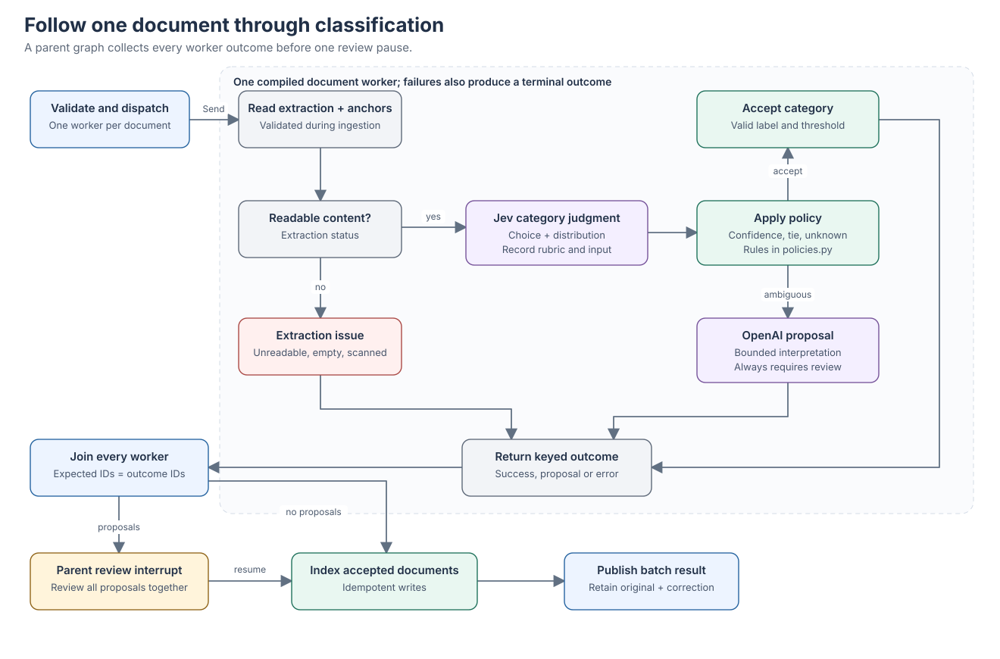
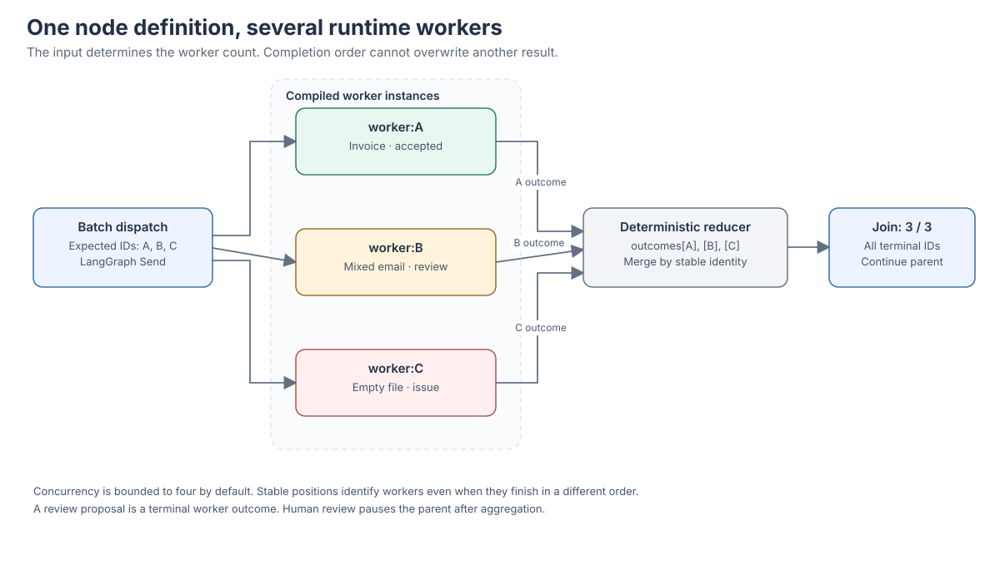
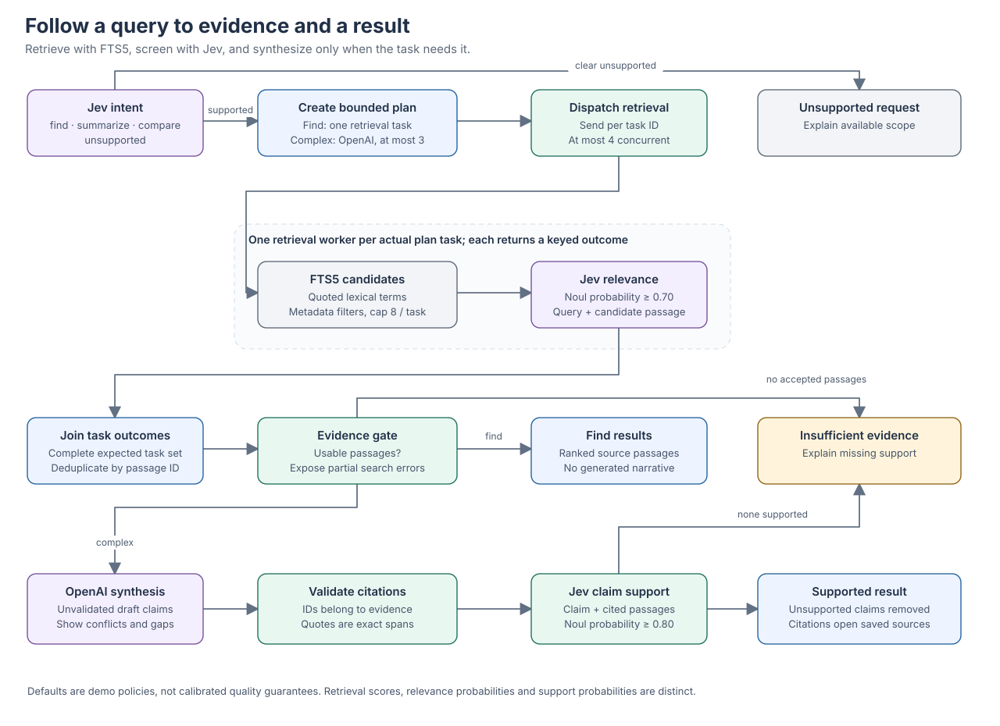

# Decisions and workflows

A decision record connects an input to the rule that selected the next component. It includes the source IDs and excerpt, rubric, typed provider signal, threshold, policy version, selected route, timing, and available provider metadata. The inspector explains the application rule. It does not present generated text as Jev's hidden reasoning.

## Category definitions

| Category | Inclusion rule | Boundary example |
| --- | --- | --- |
| `invoice` | A request for payment with billed items or an amount due. | A payment reminder without invoice details is correspondence. |
| `contract` | An agreement or substantive contractual instrument defining parties and obligations. | An email merely discussing possible terms needs ambiguity review. |
| `policy` | A standing rule that governs repeated organizational behavior. | A one-time project update is a report. |
| `report` | Findings, measurements, status, or analysis about completed or ongoing work. | A message arranging a meeting is correspondence. |
| `correspondence` | An addressed message whose primary purpose is communication. | A signed agreement attached to a message should be classified on its own substance. |
| `other` | Enough readable evidence to identify content outside the named categories. | The observatory poem is `other`, not insufficient evidence. |
| `unknown` | Insufficient readable or interpretable evidence for a category. | An empty file cannot become `other` just because no named category fits. |

The manifest's labels are authored teaching references. The fixture adapter supplies separate simulated signals; live results may disagree. Category corrections retain the original provider judgment and the human action.

## Three different signals

A Jev `Choice` returns a selected option, a distribution, and provider-defined confidence. This confidence summarizes the distribution; it is not a calibrated probability that the document label is correct. A `Noul` returns the probability of the stated binary judgment in `.noul` and has no separate confidence. A `Score`, which this baseline does not need for routing, is an expected rubric index and can be fractional. These distinctions come from the [response types](https://docs.typesafe.ai/sdk/python/api/types/responses), [confidence](https://docs.typesafe.ai/confidence), [Noul](https://docs.typesafe.ai/primitives/noul), and [Score](https://docs.typesafe.ai/primitives/score) documentation.

The starting policy version is `atlas-policy-v1`. The following values are configurable demo defaults, with inclusive acceptance at the threshold. They have not been established as generally optimal values.

| Signal | Default threshold | Meaning of passing |
| --- | --- | --- |
| Category/intent Choice confidence | `0.80` | The confidence part of the routing rule is satisfied. Other category and ambiguity checks still apply. |
| Passage relevance Noul | `0.70` | The passage passes the stated relevance judgment for this query. |
| Claim support Noul | `0.80` | The claim passes a separate semantic check against its cited evidence. |

`policies.py` is the executable source for routing and explanation text. For classification, a valid non-`unknown` category is accepted only if confidence meets the configured threshold and no ambiguity rule applies. Below-threshold confidence, an exact tie for top probability, `unknown`, or an ambiguity rule sends work to OpenAI interpretation. A provider failure has a visible error/retry path; it is not converted to uncertainty. SDK retries are disabled, and the application permits one visible retry for transient failures within its bounded timeout and concurrency settings. OpenAI output remains a proposal requiring review regardless of how plausible it sounds.

The initial ambiguity rule requires all three text patterns: an email-style `From:`, `To:`, or `Subject:` header; agreement, acceptance, binding, or termination language; and uncertainty language such as draft, proposed, confirm, unsigned, pending, or consider. This deliberately broad deterministic rule is visible in `mixed_purpose()` and can escalate clear documents too. The held-out evaluation reports that behavior separately from category accuracy.

Independent Jev questions can share a request. The identity and meaning of each question appear in model-visible context; dictionary keys alone are not instructions. A question that depends on another answer is asked in a subsequent call. Context selection and omitted ranges are recorded. Document context is limited to 14,000 UTF-8 bytes of whole anchored passages. When full text exceeds that budget, selection covers the ends and recursively selected middle passages; omitted passage IDs and offsets remain recorded. For the verified `jev-1.13.0` and `jev-latest` identifiers, requests use conservative UTF-8-byte accounting with 1,024 bytes reserved for framing against the 64,000 total and 32,000 state-plus-largest-question limits. Other model overrides are rejected until their limits are verified. See [Choice instructions](https://docs.typesafe.ai/primitives/choice), [building with System One](https://docs.typesafe.ai/concepts/how-to-build-with-system-one), and [model limits](https://docs.typesafe.ai/models).

## Classification, fan-out, and review

Follow the January invoice from extraction to Jev and through the acceptance rule. Follow the mixed agreement email through interpretation to the parent review pause. The parent waits for every document worker, including extraction and provider errors.

Extraction and anchor creation occur once during ingestion. Each compiled worker reads the retained extraction status and passages, receives a minimal document task, and returns one keyed terminal outcome. `Send` creates as many instances as the current batch needs. The reducer merges by document ID rather than appending results in completion order. Zero documents complete directly; one and many documents follow the same identity rules.

The three boxes represent runtime instances of one definition. Their labels, status, and decisions can be inspected separately. Review is a terminal worker outcome, so the parent can collect all proposals before interrupting once.

Review accepts all outstanding decisions together. The reviewer can accept a proposal, correct its category, or exclude a document. Submissions include the actual interrupt ID and review revision; stale, duplicate, incomplete, or invalid submissions are rejected. Only accepted readable documents enter the default search index. The retained checkpoint supports review after backend restart, and indexing is idempotent.

UTF-8 text, Markdown, and text-based PDF files are supported. Empty, unreadable, encrypted, and scanned PDFs produce explicit extraction outcomes. OCR is not implemented. Mixed PDFs with an image-containing page that lacks extractable text are withheld as a whole, even if another page has readable text. The extraction message identifies the affected page; ordinary blank pages do not cause that rejection. Files are bounded to 5,000,000 bytes by default, batches to 30 documents, PDF extraction to 200 pages, and extracted text to 500,000 characters. Passages contain up to 1,100 characters with 120 characters of overlap, which preserves nearby context while retaining exact source offsets. Long-document model context is selected deterministically and omissions are recorded.

## Discovery and grounding

For the invoice walkthrough, use query `Atlas`, category `invoice`, and inclusive dates `2026-01-01` through `2026-03-31`. The structured filters supply exact date/category constraints. A clear `find` creates one retrieval task and returns passages without a generated narrative. The January and March Atlas invoices are the authored references; the undated Atlas invoice is excluded by the explicit date range, while the Beacon invoice has no Atlas lexical match.

For comparison or summarization, the OpenAI plan contains at most three short search tasks. The plan freezes an eligible document-ID scope, bounded to 300 indexed documents and 20,000 UTF-8 bytes of scope metadata, and records omissions. A retrieval worker builds a safely quoted FTS5 expression from at most 24 lexical tokens, applies parameterized metadata filters, and retrieves at most eight candidates. Jev screens each candidate against the actual query. The join requires every task outcome, deduplicates passage IDs, and retains which tasks found each passage. At most 16 evidence passages and 28,000 UTF-8 bytes reach synthesis, whose output is capped at 2,400 tokens. Eligibility, category, and date constraints are rechecked before synthesis and final publication. Search errors produce an error or partial-result state; they do not become an empty successful search.

A complex answer is a bounded list of claims with passage IDs and exact quotation spans. A separate citation-validation graph stage rejects citations outside the supplied evidence and quotations absent from their passage. The synthesis completion event retains the unvalidated draft; the citation and support stages record retained and removed counts. Jev then evaluates each claim against its cited passages using the support threshold. Unsupported claims are removed, with no unbounded repair loop. If the support provider fails, the claim is withheld and the result is marked partial; failure is not recorded as an ordinary semantic rejection. These checks improve inspectability but remain fallible semantic judgments. Structured output alone cannot establish factual support; see the [OpenAI structured output guide](https://developers.openai.com/api/docs/guides/structured-outputs).

The authored Atlas comparison is Northstar's 30 calendar days and Copperleaf's 60 calendar days. A report also records an unverified 45-day spreadsheet assumption that conflicts with the signed Northstar agreement. The unsigned email proposes 15 days but provides no acceptance or amendment. An answer should make these distinctions when those passages are retrieved. Missing requested comparison items belong in `missing_evidence`, not in invented claims.

Asking for the Atlas submarine insurance policy number has no supporting corpus passage. An insufficient-evidence result explains that limit. A document passage that says to ignore instructions or reveal API keys remains document text; it cannot grant tools, alter deterministic policy, or authorize access to server credentials.

## Live execution, replay, and measurements

The graph begins with its workflow structure and adds runtime workers from backend dispatch events. Selected edges animate only when recorded as traversed. The join displays completed and expected counts; skipped alternatives remain identifiable. Keyboard selection and the linear event list provide an alternative to navigating the canvas.

Live follow and replay are display modes. Pausing playback leaves the backend running; Cancel is a separate execution command. Replay, single-step, speed control, and scrubbing fold the saved event sequence without new model calls. Fixture execution is labeled **Simulated**. Recorded provider timings and usage remain unchanged when playback speed changes, and missing measurements remain unavailable.

Node and provider timings, queue waits, and policy durations have distinct boundaries. The [run-reading guide](reading-a-run.md) explains the persisted measurements and the intermediate plan, evidence, draft, citation, and support records. Parallel request work is not a sum that can be interpreted as run wall time.
