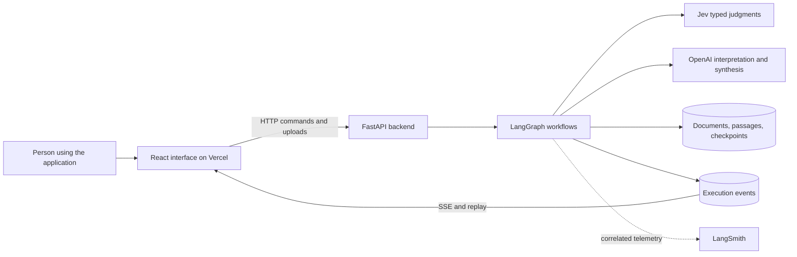
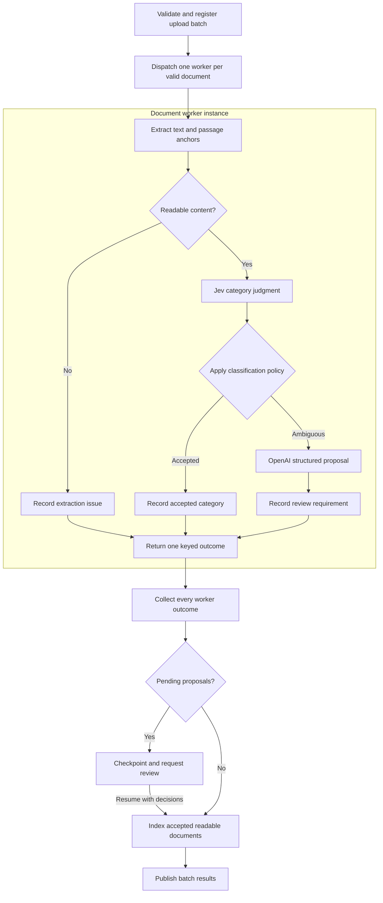

# Build a document classification and discovery application with Jev

This is a ready-to-use implementation prompt for Codex. Run it from the repository root. It specifies the application to build, the behavior to demonstrate, and the evidence required before reporting completion. The accompanying [reference research](03-reference-research.md) records what was verified and where access was limited.

## 1. Role and outcome

Act as a senior application engineer and interaction designer. Build **Document Discovery Studio**, a working application that helps a person classify documents, find relevant passages, and answer questions from those passages. Its central feature is a live, interactive view of how decisions move work through the application.

Use **Jev from TypeSafe.ai** for bounded semantic judgments, **LangGraph** for workflow control, **OpenAI** for complex interpretation and synthesis, and **LangSmith** for telemetry. Make their different responsibilities visible. A person should be able to select a decision, inspect its input and rubric, see the returned signal, understand the application rule applied to it, and follow the resulting branch.

Implement the application in this repository. Complete the code, sample data, tests, vector illustrations, and installation tutorial. Work through integration and verification; a plan, static mockup, or animated diagram alone is insufficient.

## 2. Inspect the workspace and preserve existing work

Read applicable `AGENTS.md` instructions and inspect the existing files before editing. Preserve user changes and the original brief in `notes/01-create-doc-prompt.md`.

At the time this prompt was prepared, the repository contained a minimal root `pyproject.toml`, `uv.lock`, `.python-version`, `.env`, and an empty `README.md`. The Python requirement was `>=3.14`. Recheck this state. Verify dependency compatibility before retaining or changing the Python version; explain any change and synchronize the manifest, version file, lockfile, and tutorial.

The existing ignore rules did not cover `.env`. Add appropriate secret and generated-file exclusions before staging any work. Preserve the existing `.env`; never print, commit, overwrite, or copy its values into examples. Inspect variable names and availability without exposing values.

Use the root `pyproject.toml` as the sole Python dependency manifest, with `uv` and a committed lockfile. Keep JavaScript dependencies and one JavaScript lockfile in `frontend/`. Choose verified, compatible dependency versions and record them. Do not create a second nested Python project.

## 3. Requirements that define completion

| Requirement | Required implementation evidence |
| --- | --- |
| Real Jev decisions | A backend adapter using the current TypeSafe SDK and `TYPESAFE_API_KEY`; visible decisions from a real request when credentials work. |
| LangGraph orchestration | Executed conditional branches, runtime worker fan-out, result aggregation, and a checkpointed review/resume path. |
| OpenAI for complex work | Structured interpretation of ambiguous documents and grounded answers to complex queries. |
| LangSmith telemetry | Correlated graph, provider, and retrieval traces, with a trace link when one is available. |
| Dynamic visualization | Runtime instances appear, actual transitions animate, parallel work and joins are visible, and recorded runs can be replayed. |
| Vercel-compatible frontend | A successful production frontend build and precise Vercel configuration, including the external backend URL. |
| Intuitive frontend | Frontend designed with your best UI/UX skills for modern, intuitive, highly navigatable web application. |
| Clear implementation | Small modules, typed boundaries, explicit policies, bounded work, and useful error handling. |
| Useful documentation | A design explanation, runnable tutorial, deployment guide, source record, and readable SVG diagrams in `docs/`. |

## 4. Read and apply the references

Read [the research record](03-reference-research.md), then verify the relevant primary documentation against the versions you install. If that companion file is unavailable, retrieve the linked primary sources cited throughout this prompt and the full reference list in the original brief. Record source changes in `docs/references.md`.

Study [the sample gist](https://gist.github.com/sydney-runkle/a632ba4ea0b2b72501dfa4b6ab2a7d8a). It demonstrates page-level review, typed judgments, deterministic routing, parallel work, and human review. Adapt those mechanics to this application. Document categorization, retrieval, the discovery interface, and the live visualization are application design extensions. Implement them explicitly.

The sample has a consequential mismatch between its prose and confidence-gating code. Define this application's policy in one tested module and generate decision explanations from that policy. Do not copy sample thresholds or legal review assumptions without a stated reason. Review the source's license before copying substantial code; retain attribution where applicable.

The required visual inspiration is [the canonical YouTube demo](https://www.youtube.com/watch?v=A4xZBm5eCBo). The `youtubev.com` spelling in the brief is a typo. Video content could not be retrieved during preparation of this prompt. Attempt to inspect it through available authorized tools and record concrete observations and timestamps if successful. Do not claim to have watched inaccessible content. Section 10 provides independently specified minimum visual behavior; it does not establish visual parity with the video. If access remains unavailable, complete those behaviors and report video comparison as unverified.

## 5. Product scope and example corpus

Build three connected views: **Library**, **Discover**, and **Runs**. A run opens a workspace with its graph, results, and decision inspector.

Support UTF-8 text, Markdown, and text-based PDFs. Validate file type and size, preserve filenames as display metadata, and store files under generated identifiers. Detect unreadable, encrypted, empty, and scanned PDFs; explain when text extraction or OCR is unavailable. Do not silently treat extraction failure as a successful classification.

Use a small, fictional **Project Atlas** corpus with about 14 short documents: invoices, service agreements, policies, project reports, and correspondence. Include an ambiguous agreement/email, an out-of-taxonomy document, an empty document, overlapping passages, conflicting statements, and a passage containing instructions that must be treated as document text. Provide a manifest with expected labels, supporting passages, and example queries. Synthetic documents and simulated provider results must be identified separately.

Use this initial taxonomy: `invoice`, `contract`, `policy`, `report`, `correspondence`, `other`, and `unknown`. Define each label with a short inclusion rule and one boundary example. `Other` means sufficient readable content outside the named categories; `unknown` means insufficient evidence to classify. Store both the original judgment and any later human correction.

Store a nullable ISO `document_date` with provenance, initially populated from the synthetic manifest or editable, user-confirmed upload metadata. For invoices this means the invoice issue date. Keep `uploaded_at` separate. An explicit inclusive date-range filter excludes unknown dates and shows their excluded count; the unfiltered library retains them. Perform comparisons in code.

Support these walkthroughs:

1. Import three documents and watch three classification workers appear. A clear invoice takes the Jev acceptance branch; an ambiguous item takes the OpenAI branch; unresolved work enters review.
2. Find invoices containing “Atlas” and a supplied date range. Show matched passages and metadata filters without generating an unnecessary narrative answer.
3. Ask “Compare the termination notice periods in the Atlas service agreements.” Show the query plan, parallel retrieval tasks, evidence screening, synthesis, and citations.
4. Ask about a fact absent from the corpus. Explain that the available documents do not support an answer.
5. Resume a paused review, reload the page, and replay the recorded execution with the same decisions and results.

Live model outputs may differ from these examples. Deterministic test fixtures must exercise every branch, while the interface labels the current mode accurately.

## 6. Use a small, explicit architecture

Use Python with FastAPI, Pydantic, the current TypeSafe SDK, the OpenAI Python SDK, LangGraph, and LangSmith. Use SQLite for local metadata, full-text retrieval with FTS5, the event log, and a persistent LangGraph SQLite checkpointer. Keep checkpoint storage separate from application tables if that simplifies ownership. Check FTS5 availability during setup.

Use Vite, React, TypeScript, and `@xyflow/react` for the frontend. Use a restrained CSS system with shared design tokens; add another UI or layout dependency only when it materially simplifies the implementation. Keep provider calls and orchestration in Python. Use HTTP for commands and server-sent events, or SSE, for execution updates.

FTS5 is a deliberate local baseline: explain its lexical retrieval limits. Complex query plans can supply bounded search phrases, but do not describe this as embedding-based semantic search. Defer embeddings and a separate vector database until a measured retrieval need justifies them.



The browser renders execution records. LangGraph and application policy determine what executes next. LangSmith supports inspection and evaluation; the live interface must also work when telemetry delivery is delayed.

Use this organization, combining tiny modules when appropriate:

```text
.
├── pyproject.toml
├── uv.lock
├── .python-version
├── .env.example
├── README.md
├── src/doc_discovery/
│   ├── api.py                 # App lifecycle, HTTP and SSE routes
│   ├── settings.py            # Root .env loading and validation
│   ├── schemas.py             # Documents, decisions, events, API models
│   ├── policies.py            # Versioned deterministic routing rules
│   ├── events.py              # Persistence and streaming of run events
│   ├── storage.py             # Documents, passages, search, run metadata
│   ├── ingestion.py           # Validation, extraction, stable passage IDs
│   ├── telemetry.py           # Tracing and payload filtering
│   ├── providers/
│   │   ├── jev.py
│   │   └── openai.py
│   └── workflows/
│       ├── classify.py
│       └── discover.py
├── frontend/
│   ├── package.json
│   ├── package-lock.json
│   ├── vite.config.ts
│   ├── vercel.json
│   └── src/
│       ├── components/
│       ├── views/
│       └── lib/               # Typed API client and event reducer
├── data/samples/              # Synthetic documents and expected outcomes
├── tests/                     # Provider fixtures, graph and API tests
├── docs/
│   ├── README.md
│   ├── architecture.md
│   ├── decisions-and-workflows.md
│   ├── tutorial.md
│   ├── deployment.md
│   ├── evaluation.md
│   ├── references.md
│   └── diagrams/              # Editable diagram sources and SVG exports
└── notes/                    # Preserve the brief and build instructions
```

Keep uploaded files, databases, and runtime artifacts in an ignored local directory. A single backend process with bounded asynchronous jobs is sufficient for the demo. Document its restart and concurrency limits; do not imply that an in-process task is a durable job queue.

## 7. Integrate models using verified semantics

### 7.1 Jev adapter

Use the verified TypeSafe Python interface: the distribution is `typesafe-sdk`; `AsyncTypeSafeClient` accepts `system_one(state=..., questions=...)` calls. Recheck exact imports and types against the installed release. Keep the direct `TYPESAFE_API_KEY` path as the default. [TypeSafe quickstart](https://docs.typesafe.ai/introduction/quickstart)

Use `Choice` for category and intent selection, and `Noul` for individual relevance or support judgments. The current `Choice` answer exposes `.choice`, `.confidence`, and `.probabilities`; `Noul` exposes `.noul` and has no `.confidence`. A `Score`, when useful for an ordered rubric, returns an expected rubric index that can be fractional. Preserve these distinctions in schemas and labels. [TypeSafe response types](https://docs.typesafe.ai/sdk/python/api/types/responses)

Show Choice confidence as the provider's distribution-derived confidence, not as a calibrated probability that the classification is correct. Show a Noul value as the probability of the stated binary judgment. The threshold for one is not interchangeable with the other. [TypeSafe confidence](https://docs.typesafe.ai/confidence)

Put the category definitions, question meaning, and document or passage identity in the model-visible state or instructions. Question dictionary keys alone do not supply context to the model. [Choice instructions](https://docs.typesafe.ai/primitives/choice) Batch independent judgments; a judgment that depends on another answer requires a subsequent call. [How to build with System One](https://docs.typesafe.ai/concepts/how-to-build-with-system-one)

Budget state plus all question instructions and criteria. Verify both the total request limit and the state-plus-largest-question limit for the selected model. Batch or select excerpts explicitly when either would be exceeded, and retain a record of omitted context. [TypeSafe model limits](https://docs.typesafe.ai/models)

Keep provider-specific response parsing inside the adapter. Return typed application records containing the signal, available distribution, provider request identifier, configured and returned model identifiers when available, elapsed time, usage when reported, and rubric version. Validate ranges and required fields. Set bounded timeouts and retries; coordinate these with SDK retry behavior to avoid multiplying attempts.

Jev does not supply a generated explanation for every judgment. Build the inspector's explanation from the recorded input, rubric, signal, and applied policy. Do not invent a quotation or hidden reasoning transcript.

### 7.2 OpenAI adapter

Configure the model through `OPENAI_MODEL`. Choose a currently available model that supports the required structured output features and record the model used. Do not silently inherit the sample's Anthropic dependency.

Use the Responses API with typed structured outputs for classification proposals, bounded query plans, and cited answer objects. Verify the installed SDK's asynchronous parsing interface. Handle refusal, incomplete output, timeouts, and missing parsed output explicitly. Schema conformance does not establish factual accuracy. [Official OpenAI structured output documentation](https://developers.openai.com/api/docs/guides/structured-outputs)

Give the model a bounded task and an explicit evidence collection. Validate returned category labels, document and passage identifiers, quotation spans, and plan sizes. Keep provider authentication on the server. Untrusted document text is data and cannot grant tools or change routing policy.

### 7.3 Initial policies

Put initial thresholds in configuration with a policy version. Use `0.80` as an initial Choice confidence threshold, `0.70` as an initial passage relevance probability threshold, and `0.80` as a separate claim-support probability threshold. These are proposed demo settings, not values validated by the references. Evaluate and document their effects before making quality claims.

For classification, accept a valid non-`unknown` Jev label when confidence meets the configured threshold and no ambiguity rule applies. Send low-confidence results, an exact top-probability tie, and `unknown` to the OpenAI interpretation branch. Provider failure follows a visible failure/retry path; it is not a low-confidence judgment. An OpenAI result remains a proposal requiring human review in this initial version.

## 8. Build two real LangGraph workflows

Use typed state, explicit reducers, conditional edges, and `Send` for work whose count depends on the input. Give each worker a stable identity and a minimal task payload. Distinguish a graph node definition from its many runtime instances. Use deterministic aggregation by document or task ID so parallel results cannot overwrite each other. [LangGraph Graph API](https://docs.langchain.com/oss/python/langgraph/graph-api)

### 8.1 Classification



The diagram shows the logical successful and ambiguous paths; implement explicit provider, extraction, and storage error outcomes as well. Make each document worker a compiled subgraph that returns one keyed terminal outcome on every handled path. The parent dispatches these workers with `Send` and joins only when the expected worker-ID set equals the terminal outcome-ID set. Bound concurrency, initially to four, and isolate a failed document so the batch reports all outcomes. Empty input takes a direct completion path.

Store passage text with stable IDs, source document version, page or section, and character offsets. Define a bounded document context policy: use full text when it fits, otherwise select deterministic page excerpts and record exactly what was included or omitted. Do not silently classify a long document from its first characters or split away the cited anchor mapping.

Collect worker proposals before one parent-level review interrupt. Persist a checkpoint and return a structured review request. Resume the same thread with validated human decisions using LangGraph's documented `interrupt` and `Command(resume=...)` mechanics. The interface must show the pause and resume transitions. Re-executed code before an interrupt must not repeat uploads or duplicate index writes. [LangGraph interrupts](https://docs.langchain.com/oss/python/langgraph/interrupts)

For this version, submit decisions for all outstanding items together. Include an interrupt ID and review revision in the request, reject stale or incomplete submissions, and serialize resume/cancel commands per run. Draft selections can remain in the interface until the complete submission is valid.

Keep rejected or unresolved documents out of the default searchable collection. A reviewer can accept a proposal, choose another category, or exclude the item. Record the original signal and reviewer action. Persist review state across backend restarts with the selected checkpointer. [LangGraph persistence](https://docs.langchain.com/oss/python/langgraph/persistence)

### 8.2 Discovery

1. **Interpret the request.** Jev selects `find`, `summarize`, `compare`, or `unsupported` with explicit label definitions. Low-confidence intent selection goes to a bounded OpenAI plan; a clear unsupported request returns an explanation. Structured UI filters provide deterministic dates and categories for simple searches. [Intent routing](https://docs.typesafe.ai/patterns/intent-routing)
2. **Create the work plan.** A simple `find` uses one retrieval task. Complex supported requests use OpenAI to produce at most three focused search tasks with explicit corpus scope. Validate the plan before dispatch.
3. **Fan out retrieval.** Use `Send` for the actual task list. Query FTS5 with safely constructed search expressions and parameterized metadata filters. Cap candidates and context size; expose those caps and the searched scope.
4. **Screen evidence.** Jev judges each candidate passage's relevance to the specific query. Identify that passage in the state or instructions. Use a separate typed signal for support or conflict if needed; never reinterpret retrieval scores as model confidence.
5. **Join and gate.** Each retrieval/screening worker returns one keyed outcome; wait for the complete expected task-ID set. Merge results by passage ID, retain provenance from all tasks, and exclude rejected or unresolved documents. If no passage passes the evidence policy, return an explicit insufficient-evidence result. A search error produces an error or partial-result state, not “no documents found.”
6. **Return findings or synthesize.** A `find` returns ranked passages with filters and source links. A complex request receives a bounded OpenAI answer made of claims and passage citations. Report missing evidence for requested comparison items.
7. **Validate the answer.** Check that cited IDs and quotations exist in the supplied evidence. Require one bounded Jev support judgment per generated claim against its cited passages, using the separate support threshold. Record this as a fallible semantic check. Remove unsupported claims or return an insufficient-evidence outcome; do not create an unbounded repair loop. Display conflicting evidence explicitly.

A citation must open the exact source passage, including page or section and highlight where available. Preserve citation validity after refresh and across replay by retaining the source version.

## 9. Define the execution contract before the interface

Define Pydantic API and event models first, then generate or synchronize TypeScript types with a reproducible command. Do not expose arbitrary LangGraph internal state as the public API.

Use these core records:

| Record | Necessary information |
| --- | --- |
| Document and passage | Stable IDs, content version, filename, document date and provenance, upload timestamp, extraction status, category provenance, page/section, offsets and indexed status. |
| Decision | Input references, question/rubric version, typed provider signal, threshold/policy version, selected route, rule explanation, request ID and timing. |
| Run | Run and thread IDs, kind, lifecycle status, execution mode, graph/configuration versions, timestamps, result, snapshot event cursor and available trace link. |
| Worker | Instance ID, parent instance, node name, document/task ID, attempt, state and outcome. |
| Event | Schema version, event ID, monotonically increasing sequence per run, timestamp, run ID, instance/parent IDs, attempt, event type and validated payload. |

Define run states including queued, running, awaiting review, interrupted, succeeded, partially succeeded, failed and cancelled. Support event types for run start, worker creation, node start/completion/failure, decision, selected edge, review request/resume, and terminal run outcome. Include `source_instance_id` and `target_instance_id` on edge events. Persist events before publishing them.

Adapt supported LangGraph streams and explicit lifecycle instrumentation to this contract. Verify the stream envelope for the installed version. Emit custom decision and transition data from execution code; updates alone may not expose a node's start. Do not derive completed nodes from frontend timers. [LangGraph streaming](https://docs.langchain.com/oss/python/langgraph/streaming)

Provide a compact API covering:

- Health and configuration readiness without secret values.
- Document upload, listing, metadata, and source passage retrieval.
- Starting classification and discovery runs with idempotency keys.
- Listing runs and reading a run snapshot.
- Reading ordered events and subscribing to `/api/runs/{run_id}/events` with SSE.
- Submitting review decisions and cancelling active work.
- Recovering an eligible interrupted run, or explicitly starting a linked new run when continuation is unsupported.

Document exact routes and example request/response bodies in the generated API documentation. A run-start request must return its run ID promptly; execution must not depend on the browser keeping its stream open.

SSE must support reconnection from a cursor using event IDs or an explicitly documented `after` parameter, heartbeat messages, and duplicate suppression. Close terminal streams cleanly. Each consistent snapshot includes `last_event_sequence`; reload applies only subsequent events without invoking providers. Detect gaps and resynchronize. Serialize sequence allocation across parallel workers, and give logical events unique keys so node re-execution cannot duplicate completed review/index transitions.

Make retries visible as attempts. Prevent duplicate document writes and review submissions. On backend restart, restore awaiting-review state and mark unfinished in-process jobs as interrupted. Implement the recovery action with eligibility checks and one active execution per run. Continue from compatible checkpoints with the original graph/configuration version; otherwise explain why continuation is unavailable and offer a linked new run. Do not claim exactly-once provider execution. Cancellation is best effort for in-flight calls and must prevent downstream work after it takes effect.

## 10. Make the graph a useful part of the product

Design a calm, polished desktop workspace with responsive alternatives:

- A compact header with the collection, current run, mode, and connection state.
- A left panel for documents, queries, and recent runs.
- A large graph canvas with pan, zoom, fit-to-view, and a legend.
- A right inspector for the selected node, decision, or source passage.
- A bottom timeline and results area that remain usable without reading graph internals.

Use consistent spacing, legible type, restrained semantic colors, and accessible contrast. Pair every color with a status label or icon. A narrow screen must retain the document results, decision inspector, and a linear event list. Support keyboard selection and reduced motion. Include purposeful loading, empty, disconnected, failed, and review-required states.

Implement these behaviors with React Flow's node/edge customization and application state. [React Flow documentation](https://reactflow.dev/learn)

1. Begin with the workflow structure and instantiate worker nodes as backend dispatch events arrive. Three documents must produce three separately inspectable workers; a query with two tasks must produce two retrieval workers.
2. Distinguish queued, running, succeeded, failed, cancelled, skipped, and awaiting-review states. Show several workers running concurrently when execution actually overlaps.
3. Animate an edge when control traverses it. Label branches with the applied rule. Keep unchosen alternatives muted and identifiable; do not animate them as executed.
4. Show parent/child grouping and the join's completed/expected worker count. Use stable IDs and positions to avoid constant layout jumps. Collapse large groups without hiding their status counts.
5. Clicking a decision shows its rubric, relevant input excerpt, returned label or probability, threshold, policy version, selected branch, available timing, and a plain explanation such as “Confidence met the configured acceptance threshold.” Display excerpts as input evidence, not proof of the model's internal reasoning.
6. Clicking a result citation opens its anchored passage and connects it to the relevant retrieval or synthesis step.
7. Add live follow, replay, pause playback, single-step, speed, and a timeline scrubber. Pausing playback does not pause the backend; provide a separate cancellation action. Human review is the supported execution pause.
8. Replay the stored event sequence without new provider calls. Keep recorded measurements unchanged when playback speed changes. Use an explicit “Replay” label; fixture playback must say “Simulated.”
9. Show observed elapsed time and provider call counts. Show usage or cost only when reported or computed from a cited, versioned pricing table. Missing measurements remain unavailable rather than zero.

Judge visual quality using browser inspection at desktop and narrow widths. Verify edge alignment, readable text, graph stability during fan-out, inspector behavior, and replay. Capture representative screenshots for review, plus an SVG export if feasible. Screenshots supplement the documentation's vector diagrams.

## 11. Telemetry and evaluation

Enable LangSmith through environment configuration. Trace each run and add spans for Jev requests, OpenAI calls, retrieval, policy decisions, and review actions. Preserve parent/child relationships across asynchronous workers. Attach application run IDs, worker IDs, model identifiers, rubric/policy versions, thresholds, outcomes, and available usage. Instrument direct SDK calls explicitly where automatic tracing does not cover them. [LangSmith custom instrumentation](https://docs.langchain.com/langsmith/annotate-code)

Record IDs, short sanitized summaries, and operational metadata by default. Avoid exporting full uploaded document text through automatic graph-state tracing; configure input/output filtering across graph and provider spans and verify the result. Allow deliberate fuller tracing of the synthetic corpus. Provider processing still requires sending the selected document context to the configured provider; explain that data flow in the tutorial.

Telemetry failure must not silently alter routing. Expose telemetry delivery status and retain the local run record. Flush pending traces during orderly shutdown. Only show a trace link when it resolves to a real trace.

Create a small labeled evaluation set distinct from routing unit-test fixtures. Evaluate category accuracy, ambiguous-case escalation, retrieval relevance, citation validity, answer support, provider calls, and observed latency. If tuning thresholds, separate tuning examples from held-out evaluation examples. Report counts and test conditions without claiming broad statistical reliability.

Support an optional Jev evaluator in LangSmith using a documented rubric and typed result mapping. Compare a sample of judge outputs with the labeled references; a judge score is not independent ground truth. Evaluate actual traces and intermediate behavior where relevant, not just fluent final text. Use the two evaluation references in the research record as guidance.

## 12. Configuration and deployment

Create a root `.env.example` containing names and safe placeholders. Load root `.env` explicitly on the backend, independent of the current directory. Environment values supplied by a deployment take precedence.

| Variable | Purpose |
| --- | --- |
| `TYPESAFE_API_KEY` | Required backend Jev credential for live execution. |
| `TYPESAFE_DEFAULT_MODEL` | Optional SDK-supported Jev model override; verify behavior for the installed SDK. |
| `OPENAI_API_KEY`, `OPENAI_MODEL` | Backend OpenAI credential and selected model. |
| `LANGSMITH_API_KEY`, `LANGSMITH_TRACING`, `LANGSMITH_PROJECT` | Trace authentication, enablement, and project. |
| `LANGSMITH_ENDPOINT` | Optional regional or custom endpoint when required. |
| `APP_DATA_DIR`, `APP_MODE` | Local persistence location and explicit live/test-fixture mode. |
| `JEV_CHOICE_THRESHOLD`, `JEV_RELEVANCE_THRESHOLD`, `JEV_SUPPORT_THRESHOLD` | Separate configurable confidence, relevance and support policies. |
| `MAX_CONCURRENCY`, `MAX_UPLOAD_BYTES` | Validated limits documented with their actual defaults. |
| `CORS_ORIGINS` | Explicit local and deployed frontend origins. |
| `VITE_API_BASE_URL` | Public backend URL embedded in the frontend build. |

For local development, Vite may read the root `.env` through a deliberate `envDir` setting; expose only the public `VITE_` configuration required by the interface. Never spread the entire environment into client code or prefix provider secrets with `VITE_`. [Vite environment documentation](https://vite.dev/guide/env-and-mode)

Provide a readiness page or endpoint that distinguishes missing credentials from provider outages. Live mode must never silently substitute fixtures. Offline fixtures are useful for development and CI and must remain clearly labeled. Failed live checks should leave the application runnable and expose the affected integration.

Deploy the frontend to Vercel with project root `frontend`, the Vite preset, install command `npm ci`, build command `npm run build`, and output directory `dist`. Add a rewrite if client-side routes require it. Set `VITE_API_BASE_URL` for each deployment environment and explain that changing a build-time value requires a rebuild. Verify these settings against current [Vercel Vite documentation](https://vercel.com/docs/frameworks/frontend/vite).

The Vercel build must succeed without `../.env`. Use deployment environment variables and an environment-directory setting appropriate to the selected project root; keep parent-directory loading local. [Vercel build configuration](https://vercel.com/docs/builds/configure-a-build)

Run the Python backend separately on a persistent service suitable for the chosen storage and job lifecycle. Browser uploads and SSE connect directly to that backend over HTTPS; configure CORS and avoid mixed content. Document the chosen local/single-instance SQLite limits and a future managed database/job-runner path without implementing unnecessary infrastructure.

Vercel supports Python and streaming workloads, but request duration and storage lifecycle still matter. Do not justify the split by claiming Python or SSE is unsupported. The required deliverable is frontend compatibility and a concrete deployment guide; an actual deployment is a separate action.

Vercel AI Gateway and Vercel Connect are optional integrations. Explain their roles in the design notes, but do not introduce them as mandatory dependencies or replace the required direct TypeSafe credential path. If offering Gateway later, verify model capabilities and keep it behind the same provider boundary.

The baseline is a local, single-user demonstration. Document how a deployed frontend reaches a protected backend before accepting private uploads on a public deployment. Keep this limitation concrete and avoid building a full multi-tenant system for the demo.

## 13. Write documentation that teaches the implementation

Write the documents as connected, plain explanations. Introduce each term where it becomes useful, follow one document and one query through the system, and distinguish observed behavior from proposed defaults. Link consequential integration claims to their primary sources.

| File | What the reader must learn |
| --- | --- |
| `README.md` | What the app demonstrates, a short working startup path, screenshots, and links to detailed guides. |
| `docs/README.md` | A reading path for users, developers, and deployment. |
| `docs/architecture.md` | Component responsibilities, data boundaries, storage choices, and deployment topology. |
| `docs/decisions-and-workflows.md` | Taxonomy, confidence versus probability, exact policies, worker fan-out/join, review, retrieval and citations. |
| `docs/tutorial.md` | Installation through a completed run, with expected observations and recovery steps. |
| `docs/deployment.md` | Tested frontend build, Vercel configuration, backend requirements, environment mapping and streaming verification. |
| `docs/evaluation.md` | Dataset provenance, rubric definitions, threshold tuning, measured results and remaining limitations. |
| `docs/references.md` | Every supplied reference, access status, relevant lesson, implementation choice and departures from the sample. |

Create readable vector diagrams in `docs/diagrams/` for the architecture, classification workflow, discovery workflow, fan-out/join, and the API/SSE/review sequence. Keep editable Mermaid or equivalent vector source alongside SVG exports. Use consistent labels and colors, accessible titles/descriptions, legible text, and captions explaining what to follow. Inspect the rendered diagrams for clipping and overlaps. Each arrow must represent an actual dependency, message, or control transition.

The tutorial must cover these steps in order:

1. Install the tested Python, Node, and `uv` versions; explain prerequisites and platform assumptions.
2. Work from the repository root and install Python dependencies with `uv sync` and frontend dependencies with `npm ci --prefix frontend`.
3. Create `.env` only if absent, describe each required value, preserve existing values, and explain live versus fixture mode.
4. Initialize local storage and load the synthetic corpus through an implemented command or UI action.
5. Start the backend and frontend in two terminals using exact, tested commands. A suitable backend entry point is `uv run uvicorn doc_discovery.api:app --reload`; ensure the package installs correctly.
6. Confirm readiness, import documents, inspect a Jev decision, follow an ambiguous case, and submit a review.
7. Run a simple search and the comparison query, inspect citations, and explain insufficient-evidence behavior.
8. Open the corresponding LangSmith trace, compare its spans with the interface, and replay the local event log.
9. Run tests, execute the opt-in live smoke check, and build the frontend for Vercel.
10. Diagnose missing keys, invalid keys, rate limits, unsupported files, SQLite/FTS5 issues, unavailable backend, CORS, SSE reconnects, and missing telemetry. Explain how to stop the app and reset only generated demo data.

For each step, explain its purpose, show the action, and describe the expected observation. Verify commands from a clean environment where practical. Do not publish placeholder commands as working instructions.

## 14. Fan out development work after fixing shared contracts

Use subagents when available. First agree on module ownership, API/event schemas, route names, policy definitions, and configuration. Then delegate independent work:

- **Workflow and providers:** TypeSafe/OpenAI adapters, classification/discovery graphs, policies and graph tests.
- **Interface:** React views, runtime graph, inspector, replay, and browser tests against the shared contracts.
- **Documentation and evaluation:** Synthetic corpus, source record, tutorial, SVG diagrams, and evaluation cases.

The coordinating agent owns integration, storage/API boundaries, dependency manifests, and final verification. Reassign work as dependencies become ready; use a completed worker for independent review of another area. Avoid simultaneous edits to shared contracts and lockfiles. If subagents are unavailable, follow the same dependency order sequentially.

Development subagents and application workers have different roles. The application must still demonstrate runtime `Send` fan-out even if one coding agent implements it.

## 15. Build and verify in useful increments

1. **Contracts and foundation:** Protect configuration, resolve compatible versions, define schemas/policies, create the corpus, and document the initial architecture.
2. **One complete classification:** Upload a document, call Jev, route it, persist events, render its graph and inspect its decision. Connect a real LangSmith trace.
3. **Parallel classification and review:** Add variable worker counts, bounded concurrency, OpenAI proposals, persistent review/resume, and failure outcomes.
4. **Discovery:** Add retrieval, intent routing, query planning, evidence gates, grounded answers, and source navigation.
5. **Playback and presentation:** Add reconnect/reload behavior, replay controls, responsive layouts, reduced motion, and polished empty/error states.
6. **Documentation and verification:** Finish guides and vector diagrams, run the checks below, inspect the application in a browser, and produce a concise handoff.

Use focused tests for behavior that can regress. CI must run without paid network calls; live integration tests are explicit and separate.

| Check | Pass condition |
| --- | --- |
| Routing boundaries | Tests cover just below, equal to and above thresholds, ties, unknown, malformed results, and provider errors. |
| Fan-out and join | Zero, one and several items terminate correctly; varied completion order and a failed worker do not lose or duplicate other results. |
| Review/resume | Review survives process restart; invalid, stale and duplicate submissions cannot repeat downstream writes. |
| Retrieval and grounding | Filters apply correctly; duplicate passages merge; missing or rejected evidence cannot become a supported answer; citations resolve to retained source versions. |
| Event lifecycle | Events have stable identities and ordered sequence numbers; retries, reconnects and reloads preserve the displayed state. |
| Replay | Playback and scrubbing reproduce the recorded branch selection and results with no provider calls. |
| Failure handling | Timeouts, rate limits, extraction failures, cancellation and telemetry outages leave truthful visible states. |
| Configuration | Missing live credentials are explicit; fixture mode is labeled; secrets are absent from repository artifacts, logs and frontend bundles. |
| Browser behavior | A fixture-backed end-to-end test exercises fan-out, a decision inspector, review, citations, reconnect and replay; keyboard and narrow-width use are inspected. |
| Build and docs | Python checks and frontend lint/type/build checks pass; tutorial commands, relative links and SVG renders are verified. |
| Live integration | When credentials permit, a small synthetic run verifies Jev, OpenAI and LangSmith together; record the actual result without exposing secrets. |

Run the minimal live smoke test after offline checks. Keep provider calls bounded and use only the supplied synthetic corpus. If credentials, account access, network access, or tools prevent a check, finish unaffected work and report exactly what remains unverified. Do not replace a failed integration with simulated success.

## 16. Final handoff

Report the implemented behavior, the main files, exact startup commands, checks performed and their outcomes, and any remaining limitations. Include the location of the tutorial and diagrams. Distinguish offline test success, actual live provider verification, Vercel build compatibility, and an actual deployment.

Before finishing, demonstrate that a reader can answer: **What input produced this judgment, which rule selected the next component, what ran in parallel, where did work pause, and which source passages support the final result?**
