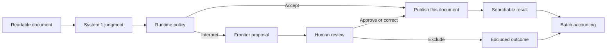

# Codex implementation brief: make disaggregated intelligence visible

**Prepared:** September 29, 2026  
**Application:** Document Discovery Studio  
**Scope:** Education-first redesign of the whole app, including its entry page, navigation, Classification, Discovery, and `/#workflow`  
**Status:** Proposed implementation plan. Creating this document does not implement the changes below.

## 1. Instruction to Codex

Goal: Redesign this application around its primary purpose: teaching disaggregated intelligence through interaction. A first-time user should understand how bounded judgment, runtime policy, frontier interpretation or generation, deterministic code, and human approval cooperate. Make the consequences observable: which frontier calls are avoided, which results become available sooner, and which checks control publication.

The user explicitly permits redesigning the whole app to serve this purpose. Reuse sound execution, replay, and data foundations, while changing the page hierarchy, navigation, layout, labels, and entry experience as needed. Inspect the current implementation before editing; some of the requested behavior already exists. Follow the phases in Section 13, implementing and verifying each complete slice before proceeding. Use this document as an implementation brief when the user asks you to execute it.

The experience must answer five questions through interaction:

1. What bounded judgment did System 1 return?
2. Which runtime rule selected the next action?
3. Why does this task require a frontier model, ordinary code, or human approval?
4. What work, delay, and cost does this allocation avoid or introduce?
5. What prevents an uncertain or invalid result from being published automatically?

Teach through contrasting examples, visible choices, and concrete outcomes. A person should be able to use the app without reading a tutorial or a page of explanatory text. Keep implementation diagnostics and extended explanations in inspectable details. Reuse recognizable visual elements where useful, but do not preserve the existing dashboard structure at the expense of learning. This brief is deliberately detailed; the interface it specifies must be concise.

## 2. Teaching contract

The central explanation is:

> System 1 returns a bounded judgment. The runtime applies explicit policy and selects the next capability. Frontier models handle interpretation and open-ended composition when needed. Code validates contracts and performs deterministic operations. Human review controls designated approvals.

Present the benefits with their conditions:

| Idea | What the user should observe | What must support the claim |
| --- | --- | --- |
| Separate capabilities | One request moves among bounded judgment, code, generation, and approval. | Actual recorded component responsibilities and calls. |
| Reserve frontier work | Clear classifications bypass interpretation; ambiguous cases enter it. | Call counts, route reasons, and readable inputs. |
| Make routine work available sooner | An accepted document becomes searchable while another awaits review. | A real indexing commit and a successful retrieval before review completes. |
| Make routing predictable | The same signal and policy version produce the same selected route. | Deterministic policy evaluation; model outputs can still vary between calls. |
| Control publication | A proposal or invalid citation cannot bypass the relevant checks. | Enforced workflow rules and negative tests. |
| Reduce cost when the workload permits | Separate costs for bounded calls, frontier calls, and other work. | Measured usage or explicit assumptions, with a comparable baseline. |

Confidence is a model signal, not a demonstrated probability of correctness. Fewer frontier calls do not establish lower total cost, lower end-to-end latency, or higher accuracy. A constrained output schema does not establish semantic correctness. Describe a model as the cheapest suitable option only when an evaluation and a cost comparison support that selection; otherwise describe its configured role.

Frontier work has two positive roles: resolving ambiguity and performing deliberately requested open-ended work. The Discovery lesson must show both capability allocation and the limits of the classification fallback example.

## 3. Verified starting point and gaps

This inventory reflects the source inspected when this brief was written. Recheck it before implementation. See [the current classification review](../docs/classification-replay-review.md) for existing verification and limitations.

| Area | Already present | Required extension |
| --- | --- | --- |
| Classification examples | Clear category, uncertain judgment, and policy exception selectors; four readable fixture documents. | A controlled document pair, stronger source evidence, and an experiment mode. |
| Decision graph | Separate System 1 and runtime policy responsibilities; accepted and Interpret branches; optional full workflow. | Keep the decision central and connect it to publication and comparable outcomes. |
| Decision evidence | Category, confidence, recorded threshold, reason, selected action, and simulated-provider disclosure. | A compact causal receipt with relevant source evidence and policy provenance. |
| Classification comparison | Recorded request attempts compared with a hypothetical frontier call per readable input. | Synchronized batch comparison with explicit assumptions, denominators, and quality boundaries. |
| Workflow comparison | `/#workflow` has two lanes, modeled time/cost, optional LLM redaction, and human review. | Reuse its components and lessons; share comparison semantics without changing the legal-review task. |
| Motion | Shared vivid paths, directional highlights, numbered markers, pause, and reduced-motion behavior. | Maintain one motion contract across the new modes; separate playback from work time. |
| Discovery | Intent judgment, optional frontier planning, code retrieval, bounded screening, optional frontier composition, citation validation, and support checking. | A guided Find versus Compare lesson that exposes these responsibilities. |
| Publication | Classification waits for all workers and any batch review before indexing. | Independent publication of accepted documents, with safe resume and accurate events. |
| Teaching data | Content-bound fixture signals; successful seeded runs; unsuccessful entries archived from main lists. | Version new scenarios; keep operational data and deliberate fault demonstrations distinct. |

The live classification request currently accepts at most **30 documents**. The proposed 100-document comparison is a virtual workload illustration. Do not increase the API limit or create 100 persisted documents merely to animate it.

The current four-document teaching set deliberately emphasizes exceptions. Its two direct and two escalated examples do not estimate the exception rate of a production workload.

## 4. Education-first app structure and navigation

### 4.1 Primary navigation

Make **Explore**, **Compare**, and **Experiment** the three primary destinations across the app. These are persistent navigation links with URLs and browser history, not a second row of tabs added inside the existing Run workspace.

| Destination | User's purpose | Primary content | Primary action |
| --- | --- | --- | --- |
| **Explore** | See how a task is divided among capabilities. | One example, its focused flow, compact decision evidence, and an outcome. | Play the example. |
| **Compare** | See what changes when the same work is allocated differently. | Two synchronized strategies, outcome counts, inspectable assumptions. | Compare this workload. |
| **Experiment** | Discover what changes a decision. | A document or policy change beside its original result. | Change one input or rule. |

Put **Documents** and **Runs** in a clearly labeled secondary workspace group, reachable from every primary destination. Keep those labels visible; do not hide them behind unfamiliar icons. Source inspection can use a drawer, and full run inspection can use the existing detailed workspace. These are useful tools supporting the lessons rather than the default landing experience.

Map the current surfaces deliberately:

| Current surface | Proposed place | Continuity requirement |
| --- | --- | --- |
| Initial landing or workflow dashboard | Explore, with a ready-to-play classification example. | No upload, provider key, or run creation required to begin a simulated lesson. |
| Document Classification replay | Explore with that run/document selected; detailed inspection remains available. | Preserve the original run and return path. |
| Discovery | A Find & compare scene plus a clear action to search the user's actual documents. | Preserve query, filters, citations, and source inspection. |
| `/#workflow` | A Review & redact scene, with its strategy comparison available through Compare. | Preserve the existing legal-review example and old URL through an explicit alias or redirect. |
| Library | Documents utility destination. | Upload, source inspection, provenance, and archive behavior remain accessible. |
| Runs | Runs utility destination. | Preserve history, replay, review, and recovery controls. |

Do not require users to understand “AgentGraph,” worker instances, run IDs, or replay event numbers to choose a lesson. Use those terms in technical inspection where relevant.

### 4.2 Scenes and persistent context

Within Explore, offer three plainly labeled scenes: **Classify documents**, **Find & compare**, and **Review & redact**. Present them as compact task choices, not another competing application navigation bar. Put safeguard exercises within Experiment so the default scene choices remain few.

Keep the selected scene, example, and data provenance visible when switching to Compare or Experiment. For classification, maintain the same selected document wherever a corresponding comparison is available. If a destination requires another example or lacks a supported comparison, explain that briefly and provide an explicit selection; never silently replace the user's context.

Preserve navigation with refresh, deep links, and browser back/forward. Distinguish page navigation from view controls such as play, source inspection, and full workflow. A direct link to a historical run must remain valid. When opening a run from a lesson, offer a clear return to that lesson.

Use one navigation pattern consistently across desktop and mobile. At narrow widths, keep the three primary destinations directly reachable and place the two workspace utilities in a labeled menu if needed. Use proper navigation semantics for routes and tab semantics only for local panels.

The primary Compare destination means **Compare strategies**. In Discovery, label the task action **Compare policies** or another specific document comparison. Keep these scopes explicit so the two uses of “compare” do not create navigation ambiguity.

### 4.3 The first screen

Land directly on a prepared, paused classification example. Make one primary button, such as **Follow this invoice**, immediately apparent. Show the three contrasting example choices without requiring scrolling: **Clear invoice**, **Ambiguous report**, and **Unsigned agreement**. Each choice has a document icon, a short route cue, and a selected state.

The user should see what to click and what is moving before encountering explanatory prose. No mandatory tour, onboarding modal, introductory article, or empty operational dashboard should stand between entry and the first lesson. Prepare fixture content without making provider calls or writing a new run on every page visit.

Suggested desktop hierarchy:

```text
Discovery Studio     Explore | Compare | Experiment     Documents | Runs

Classify documents       [Change scene]              Simulated lesson
[Clear invoice] [Ambiguous report] [Unsigned agreement]

Following: Unsigned agreement                 [View document]

Read → System 1 → Runtime policy ── Accept category ──→ Publish
                              └── Interpret → Review → Publish

Judgment: Contract · 96%    Rule: Proposed terms    Action: Interpret
“The guard requires review despite high confidence.”        [Why?]

2 searchable · 1 interpreting · 1 awaiting review
[Play / pause] [Step] [Timeline]                 [Inspect full workflow]
```

This describes the information hierarchy and target states. The exact graph, badges, and counts must match the selected example's event prefix. In particular, keep the existing batch publication barrier visible until Section 9 is implemented. Older recordings must continue to show their recorded behavior.

### 4.4 Teach with interaction and concise text

Apply progressive disclosure in three layers:

1. **Visible by default:** the example, selected route, short judgment/rule/action labels, one outcome, and an obvious next action.
2. **On selection or Why:** relevant source excerpt, threshold or guard, and a concise explanation of the selected capability.
3. **Inspect:** full signals, policy versions, model configuration, event history, metric definitions, and evaluation assumptions.

As design targets, keep the main explanation to one sentence of about 20 words, button labels to a few familiar words, and cards to a title plus one short supporting line. These are editorial targets, not automatic truncation rules. Keep essential provenance, review status, and metric units visible even when space is limited. Replace persistent paragraphs with a useful interaction wherever possible.

Show a short role label on each component: **Judge**, **Route**, **Interpret**, **Retrieve**, **Validate**, or **Approve**. Keep configured model names secondary. Use the same role treatment across scenes so users learn the visual vocabulary once. Tooltips may explain details but cannot contain the only explanation of an action or status.

Keep the full document tray and technical graph available through disclosure. Do not require horizontal scrolling to discover the three principal classification examples. On a narrow screen, use a vertical journey, compact evidence, and stacked comparison lanes. Avoid shrinking the desktop canvas until its labels are unreadable.

### 4.5 Connected learning path

Use contextual next actions to connect the lessons:

1. Follow a clear invoice and observe no frontier interpretation.
2. Follow the ambiguous progress document and inspect the uncertainty rule.
3. Follow the unsigned agreement and inspect the high-confidence policy exception.
4. Compare the batch and inspect avoided frontier calls.
5. Change a policy or document variant in Experiment.
6. Continue to Discovery and compare Find with Compare.

Use specific action labels such as **Try an ambiguous document**, **Compare this batch**, and **Change the threshold**. Allow every step to be skipped or revisited. The app must remain useful without a tour or reading the steps as instructions.

The initial experience should make the mechanism understandable within a short interaction: select an example, follow the document, see the chosen branch, and inspect its outcome. Treat a roughly one-minute first walkthrough as a design target to validate, not an already measured usability result.

## 5. Follow a document: explain the branch

### 5.1 Decision receipt

Extend the existing evidence component. Present these fields in reading order:

| Field | Example | Source of truth |
| --- | --- | --- |
| Document evidence | An excerpt discussing proposed terms and pending acceptance. | Versioned document text or recorded decision input. |
| System 1 output | `category: contract`, `confidence: 0.96`. | The recorded structured signal. |
| Runtime policy | Mixed-purpose guard matched; acceptance threshold is 0.80. | Recorded rule, threshold, and policy version. |
| Selected capability | Interpret ambiguous content with the configured frontier model. | Recorded selected route and provider metadata. |
| Permitted next action | Produce a category proposal; human approval is required. | The workflow's enforced review contract. |
| Result | Proposed correspondence; subsequently corrected, approved, or excluded. | Events visible at the current replay position. |

This table specifies the available evidence, not six permanently expanded panels. By default, show compact judgment, rule, and action fields; reveal the excerpt and longer explanation on selection or Why. Keep the headline to one sentence. Offer the full signal distribution, configuration, and timing through Inspect. Use source excerpts to explain observable evidence; never invent the model's hidden reasoning. If the implementation cannot identify an exact matched span, label the text as relevant context rather than claiming the model attended to it.

The current mixed-purpose rule is a text heuristic. Explain its actual scope; do not describe it as a general determination of contract enforceability or signature validity.

### 5.2 Replay behavior

- Selecting an example moves to just before its decision, keeps the document identity visible, and starts the short sequence.
- The receipt updates with the same event prefix as the graph. Scrubbing backward removes later proposals, approvals, publications, and counters.
- The unselected branch stays visible with its condition label. Only the selected branch carries the moving document.
- Labels distinguish `Category accepted`, `Proposal awaiting review`, and `Searchable`. Acceptance alone must not imply publication.
- Preserve a readable final state after animation ends. A user who pauses or disables motion must learn the same lesson.
- Whole-recording summaries may remain available, but they must be labeled separately from the replay cursor's current state.

### 5.3 Controlled document variants

Add a finalized service agreement variant alongside the unsigned proposal example. Preserve the subject, parties, scope, and approximate length so the material difference is easy to see. Highlight the changed wording in a compact comparison.

In the prepared lesson, hold the bounded category and confidence constant to isolate the guard's effect, and explicitly label that controlled assumption. Verify both documents against the actual policy function. Do not accidentally retain trigger words in a negated sentence and then force the desired route with UI logic.

In live mode, changing content requires a new judgment. Never carry over a previous confidence value as if it were measured on the edited document.

## 6. Compare strategies: show allocation and consequences

### 6.1 Two distinct comparison sources

Support these sources without blending their evidence:

1. **This recorded batch.** Use its actual documents and recorded calls. Until both strategies have been executed under a comparable protocol, label the alternative as hypothetical.
2. **Illustrative workload.** Use virtual documents and editable assumptions. Start with 100 readable documents, 80 direct decisions, and 20 exceptions. These proportions are teaching assumptions, independent of the four-document fixture set.

For the illustrative scenario, show:

| Strategy | Bounded classification calls | Frontier classification or interpretation calls |
| --- | ---: | ---: |
| Frontier for every document | 0 | 100 |
| System 1 with frontier exceptions | 100 | 20 |

The supported headline is **“80 frontier calls avoided in this illustrative classification workload.”** Show both request categories so the user can see that total model requests increased from 100 to 120. Separate any shared generation, redaction, or validation work from the classification comparison.

Use the same document order, output taxonomy, eligible inputs, publication semantics, review obligations, and resource assumptions in both lanes. A baseline must pass through equivalent runtime safeguards. Do not remove validation or review from one strategy to manufacture an advantage.

In the virtual comparison, prepared final categories and review outcomes are held equal by assumption to isolate work allocation; disclose this beside the comparison. The existing frontier Interpret adapter produces proposals requiring review, so it is not automatically a valid frontier-for-every-classification benchmark adapter. A measured baseline needs an explicit classification contract and the same publication safeguards. Count any additional interpretation, validation, or retry calls that contract requires. The 100-call baseline is a stated one-call illustration, not a promised result of the current backend.

### 6.2 Visual behavior

- Keep one selected document prominent in both lanes so its treatment is comparable.
- Show other documents as lightweight markers or counted groups; explain aggregation and preserve exact counts. Avoid rendering a dense cloud of 100 numbered cards.
- Expose queued, processing, awaiting review, and searchable counts. A queue is not a completed outcome.
- Let users choose a routine document or an exception to compare. An exception may take longer under the System 1 strategy because it includes an additional judgment.
- Put three primary measures beside the lanes: frontier calls, searchable results, and time to first searchable result. Expand for other measures and assumptions.
- Include a details table with absolute values for both strategies before presenting differences.

### 6.3 Clock and scheduling rules

There are three separate notions of time: recorded wall time, modeled scenario time, and presentation time.

For a timed comparison, advance both lanes through one shared recorded or simulated work clock. If visual time is compressed, apply the same monotonic time mapping to both lanes. Do not independently shorten each lane's slow steps and then present the resulting animation as a timing comparison.

The existing per-node compression remains useful for a conceptual walkthrough. Label that mode “Illustrated steps” and use the timing chart for quantitative comparison. A change to playback speed must never change final metrics or the ordering of events on the underlying shared clock.

A batch model must state concurrency and queue assumptions. Sum of provider durations is work consumed, not batch wall time. Use a deterministic scheduler for the virtual scenario and disclose its provider capacity, arrival schedule, service times, and review delay. The default can use fixed service times; that produces a deterministic illustration, not a latency distribution.

### 6.4 Metric definitions

| Metric | Definition and display rule |
| --- | --- |
| Eligible documents | Readable documents in the selected workload. Exclude unreadable inputs explicitly. |
| Bounded/frontier calls | Request attempts actually started, separated by capability; count retries. Explain this counting point consistently across pages. |
| Escalated documents | Distinct documents sent to interpretation. Keep separate from frontier attempts. |
| Autonomous acceptance coverage | Distinct documents accepted without review divided by eligible documents. Do not label it accuracy. |
| Frontier calls avoided | Baseline classification/interpretation attempts minus the alternative's attempts, for the same scope. Allow negative values when retries or extra work reverse the advantage. |
| Time to decision | Elapsed time from a stated common start to the relevant routing decision. |
| Time to first searchable result | Batch start to first committed publication; unavailable if publication has not occurred. |
| Batch completion time | Batch start to all terminal outcomes; keep review wait visible. Report machine work separately. |
| Cost | Sum of included request/operation costs. Show currency, source, date where relevant, and missing categories. Unknown cost is not zero. |
| Quality | Reference-label agreement, reference-policy violations, or reviewed outcomes with explicit denominators. Unavailable without an evaluation set. |

For the simplest cost illustration, with no retries or differing downstream work:

```text
N = eligible documents; E = documents requiring interpretation
baseline cost = N × frontier classification cost + baseline other work
disaggregated cost = N × bounded judgment cost
                   + E × frontier interpretation cost
                   + disaggregated other work
estimated saving = baseline cost − disaggregated cost
```

Keep frontier classification and interpretation prices separate; their prompts and outputs can differ. Actual accounting must sum attempts and usage rather than assume identical per-call cost. Include human time only if it is modeled explicitly and equally; otherwise state that it is excluded. Require a zero-denominator guard for percentage comparisons.

Do not claim general speed, cost, or accuracy gains from fixture runs. A measured benchmark requires both strategies to run on the same held-out labeled corpus, comparable settings, documented model versions, equivalent review rules, and retained timing/usage records. Show sample sizes; do not present a meaningful tail-latency estimate from a handful of teaching documents.

## 7. Experiment: make the causal relationship interactive

Implement a visibly separate simulation with three controls:

1. Acceptance threshold.
2. The mixed-purpose guard, enabled by default.
3. The prepared document variant: proposed terms or finalized agreement.

Keep the original recording on one side and the simulated decision on the other. State exactly which variable changed. Include Reset and a persistent “Simulation — does not change this run” label.

Evaluate the same authoritative policy function used by the runtime. Prefer a small read-only simulation service over maintaining a second policy implementation in the frontend. It must make no provider calls, write no operational run, and change no global configuration. Use typed inputs, bounded content, and explicit policy/scenario versions. An alternative architecture is acceptable if equivalence is verified against the backend policy.

For threshold experiments, hold the prepared signals fixed. Show how coverage and escalation change. Keep the high-confidence guard example escalated until its applicable guard changes; lowering the threshold alone must not bypass it. Preserve the policy's precedence for unknown choices and tied probabilities.

When reference labels and expected policy outcomes are supplied, show newly accepted mistakes or policy violations alongside increased coverage. Without those references, display “Quality effect not evaluated.” Do not imply that a higher threshold automatically proves greater accuracy.

Changing a prepared document uses its own content-bound fixture. Explain when a controlled pair holds the signal constant. A freeform document upload belongs to a real classification action, outside this no-call experiment.

## 8. Scenario and document specification

Retain the four existing readable classification documents and add only the material needed for the new lessons.

| Scenario | Material | Expected lesson behavior |
| --- | --- | --- |
| Clear invoice | Existing itemized invoice. | Prepared invoice judgment at 0.97; accepted without interpretation under the default policy. |
| Standing access policy | Existing access policy. | Prepared policy judgment at 0.96; accepted without interpretation. |
| Billing versus progress | Existing document reporting progress and estimating a future charge. | Prepared invoice judgment at 0.58; below-threshold interpretation; prepared report proposal. |
| Proposed agreement | Existing unsigned agreement correspondence. | Prepared contract judgment at 0.96; mixed-purpose guard; prepared correspondence proposal. |
| Finalized agreement | New controlled variant of the proposed agreement. | Prepared high-confidence contract judgment; actual guard no longer matches; direct route. |
| Find versus Compare | Two short policy versions with explicit differences in access duration or approval requirements. | Direct retrieval for Find; evidence-based comparison for Compare. |
| Reliability exercises | Copies or isolated fault responses associated with the same readable examples. | Validation and recovery lessons without adding broken operational samples. |

Keep every normal teaching document substantive, fictional, readable, and useful in the source viewer. Use reserved example domains for fictional correspondence. Do not put instructions addressed to the classifier into documents to force escalation.

Extend the manifest with versioned scenario metadata as needed: teaching purpose, content hashes, fixture signals, expected route/reason, reference category, expected policy outcome, and simulated review behavior. Distinguish expected assertions from observed results. Test fixtures may assert an expected route; the UI must display the route that execution actually recorded.

Preserve the existing restriction that prepared signals apply only to synthetic, content-matched fixtures. A renamed ordinary upload or modified file must not silently inherit a prepared response. Live providers always process the actual input.

Version new teaching recordings instead of rewriting old events. Seed completed examples idempotently. Keep scripted human approval visibly labeled. Preserve archived runs and document history; do not rerun cleanup against user data as a side effect of opening a lesson.

## 9. Make independent publication real

This is a backend workflow change with UI consequences. Treat it as a separately verified implementation phase.

### 9.1 Target behavior

An accepted document can be indexed and retrieved while other documents are still being interpreted or awaiting review. A proposal remains unsearchable until a valid review decision authorizes publication. The batch's final status continues to represent every input.



This diagram describes the target success/review paths. Actual failure and cancellation paths must also remain explicit in the implementation and replay.

### 9.2 Implementation constraints

1. Inspect `classify.py`, storage transactions, checkpoint behavior, and event persistence before selecting the design. A suitable starting point is publication inside each accepted worker, with a shared idempotent publication operation for post-review approvals. Final aggregation reconciles outcomes rather than repeating successful publication.
2. Commit accepted metadata, searchable content, and a durable publication record consistently. Use the smallest compatible transaction or outbox design that prevents a crash from leaving the replay and search index permanently inconsistent.
3. Identify publication by document content version and accepted decision/review identity. Replayed checkpoints and duplicate submissions must not duplicate index entries or successful-publication counts.
4. Emit per-document publication events or typed node transitions. A completed provider request or accepted category is insufficient evidence of searchability.
5. Keep publication status separate from classification outcome. An indexing failure must remain a failure even if classification succeeded.
6. Preserve valid review revisions, correction/exclusion semantics, archive protections, cancellation, and admission checks. A late callback after cancellation or archival must not publish new work.
7. Define reclassification behavior for an already searchable document explicitly. Preserve or deliberately withdraw its previously approved version according to a documented rule; avoid an accidental visibility gap from intermediate metadata updates.
8. Version changed workflow semantics and events. Historical replays must not acquire early-publication behavior they never recorded. Existing recoverable checkpoints require a compatible resume path or an explicit migration policy; never silently resume them through a different graph.

The UI may show **“2 documents searchable · 1 interpreting · 1 awaiting review”** only when those states are supported by the recorded prefix. `Collect outcomes` describes batch accounting; it must no longer look like a gate that every already published document is waiting behind.

A representative acceptance test holds one worker or review pending, queries search for a separately accepted document, and verifies that its accepted version is available before the held work is released. A second test denies publication to the pending proposal.

## 10. Discovery: illustrate capability allocation beyond escalation

Add two guided actions using the paired policy documents:

- **Find the access policy.** Explain that a clear find intent selects lexical retrieval and evidence screening without composing a narrative answer.
- **Compare the two access policies.** Explain that the requested output requires planning and composition over retrieved evidence, followed by citation and support checks.

Expose the existing responsibilities in the graph:

| Step | Capability | Teaching point |
| --- | --- | --- |
| Understand request | Bounded intent judgment. | Choose among defined task types. |
| Plan retrieval | Code for a clear Find request; frontier planning when the recorded route requires it. | Runtime selects the planning capability. |
| Retrieve | Deterministic search code. | Retrieve source passages without asking a model to invent facts. |
| Screen evidence | Bounded relevance judgments. | Evaluate constrained questions over candidates. |
| Compose comparison | Frontier generation when sufficient evidence and intent permit it. | Open-ended work is deliberately assigned to a generative model. |
| Check citations | Exact validation in code. | Reject invalid references or quotations according to the implemented contract. |
| Check support | Bounded semantic judgments. | Screen whether evidence supports claims; this check remains fallible. |
| Present results | Runtime-controlled output. | Show supported results and missing evidence explicitly. |

Do not hide frontier planning to create an artificially simple diagram. Show actual calls in the selected route. Do not guarantee that every live Find request avoids frontier planning; ambiguity can change its route. Empty retrieval and unsupported intent must produce their real outcomes.

Use role labels first and configured model names second. An optional component detail can state why that configured role was selected. Do not add a model marketplace or claim adaptive selection among models when the runtime uses a single configured frontier provider.

Link from a searchable classification result to these discovery examples so users experience a complete path from document intake to an evidence-backed result.

## 11. Reliability exercises

Add an optional “Explore a safeguard” entry within Experiment or the guided lesson. Keep it out of the default successful-run list. Fault injection must be isolated from live provider configuration and normal uploaded documents.

| Exercise | Expected visible behavior | Required verification |
| --- | --- | --- |
| High confidence plus guard | Runtime selects interpretation and review despite high confidence. | Actual policy precedence. |
| Invalid category proposal | Validation rejects it; no automatic publication. | Provider/schema boundary and review controls. |
| Unsupported citation | Invalid claim is withheld or the result is marked appropriately incomplete. | Exact implemented citation behavior. |
| Provider timeout | A visible failure or bounded retry; other independent documents continue where supported. | Real retry policy, attempt counts, and isolation. |

Implement missing behavior before portraying it as a working safeguard. Do not animate a retry if the runtime does not retry that error. Show `Attempt 1 of 2`, for example, only when that is the configured limit. Let users inspect the rejected response or validation result without presenting it as a valid outcome.

A successful exercise means the safeguard behaved as specified. It does not mean the underlying document completed successfully. Keep these two statuses distinct.

## 12. Shared animation, interaction, and data contracts

### 12.1 Motion and accessibility

Reuse `FlowMotion.tsx` and `flow-motion.css` for Classification, Discovery, and Workflow. Preserve the established selected-path treatment as a starting point: approximately 6 px core, broad low-opacity halo, directional highlights, and one numbered document marker. Tune through rendered inspection rather than increasing glow indiscriminately.

- Use consistent semantic roles, labels, and icons. Color supplements meaning; it cannot carry it alone.
- Animate from source to destination once per recorded transfer. Never loop a document through a decision or route it along an unselected branch.
- Keep completed routes solid and alternatives quiet but legible. Separate the current transfer from the visited path.
- Keep ordinary walkthrough holds brief; give the policy decision enough reading time. As initial presentation targets, use roughly 150–300 ms for routine holds, 500–800 ms for transfers, and 800–1,200 ms for a decision. These are tunable animation settings, not performance measurements.
- Support play/pause, step, seek, speed, and replay from the decision. Pause freezes the marker and highlights. Changing speed preserves progress.
- Never block source inspection or example selection behind an animation. Avoid camera movement on every node; respect manual pan/zoom and provide an explicit refocus control.
- With reduced motion, show a static selected route, current-step marker, and identical evidence. Avoid flashing and continuous attention-seeking effects.
- Provide keyboard operation, visible focus, accessible button names, and restrained status announcements at semantic transitions. Do not announce animation frames or every batch counter tick.
- Verify both themes, narrow screens, 200% zoom, touch targets, and readable contrast. Keep controls available without covering the current decision.

### 12.2 Provenance and state

Use explicit, orthogonal provenance fields: a source may be synthetic, its provider response simulated, its runtime rule actually executed, and its timing illustrative. A single global “Simulated” dot is insufficient when panels combine these kinds of evidence.

Extend existing types rather than introducing an unrelated event system. The conceptual contracts are:

| Record | Required information |
| --- | --- |
| Decision receipt | Document/content version, decision ID, signal, input reference/excerpt, policy version, threshold, matched reason, selected action, provider/configuration, replay sequence. |
| Comparison scenario | Version, source mode, corpus identity or virtual mix, strategy definitions, capacities, work-time/cost assumptions, review/publication rules, deterministic seed where used. |
| Publication | Document/content version, authorizing decision or review, commit identity, status, time, and event sequence. |
| Metric | Name, value or unavailable state, unit, denominator/scope, provenance, counting boundary, and source event range. |
| Experiment | Original run/decision reference, changed inputs or policy values, simulated output, policy/scenario version, and explicit no-write status. |

Never use a future document's mutable database state to fill in an earlier replay frame. Recorded run configuration takes precedence over current application settings. Guard against stale simulation responses when users change controls quickly or switch documents.

For UI and API changes, update schemas, generated frontend types, reducers, replay selectors, and documentation together. Add backward-compatible handling for optional new fields. For unknown historical values, display unavailable rather than inventing a default that changes the meaning.

## 13. Implementation phases and repository map

### Phase 0 — Establish the learning structure and baseline

Read applicable repository instructions and the current source. Record which parts of this brief already exist. Map the entire app into the primary learning destinations and secondary workspace utilities. Inspect the live page where the environment permits, then capture baseline desktop and narrow-screen states. Confirm existing tests and document any pre-existing failures.

**Exit condition:** A short implementation checklist maps navigation, first-use behavior, existing capabilities, affected contracts, and the chosen phase order. Reorganize Library, Runs, and Workflow as needed for this educational purpose; blog and slide deliverables remain outside scope.

### Phase 1 — Build the education-first shell and document lesson

Implement Explore as the default entry, the shared app navigation and context, the improved decision receipt, controlled document pair, and clearer accepted/proposed/searchable labels. Keep incomplete destinations out of navigation until their vertical slice works. Migrate existing routes with continuity, and preserve old recordings and shared motion. Keep the primary screen concise; move extended explanation into Why and Inspect.

**Exit condition:** A user can start a lesson without setup, replay all three branch types, inspect source evidence, and explain the runtime's role without reading an introductory article or opening raw events. Source/run utilities remain easy to reach. Deep links, back/forward, and replay remain faithful.

### Phase 2 — Add policy experiments

Implement the authoritative no-write simulation, threshold/guard/variant controls, reset behavior, provenance labels, and reference-based tradeoff display.

**Exit condition:** Boundary tests match the real policy; changing a hypothetical setting does not mutate the source run, call a model, alter current provider settings, or persist a new operational run.

### Phase 3 — Add the batch comparison

Implement this-batch and virtual-workload comparison sources, deterministic scheduling, shared clocks, metrics, and assumptions. Extract shared presentation primitives from Workflow where useful. Preserve that page's legal-review meaning and existing controls.

**Exit condition:** The default 100/80/20 illustration produces the specified call counts; retries, zero-cost assumptions, changed concurrency, and all-exception scenarios remain honest. Current batch publication behavior remains visible until Phase 4.

### Phase 4 — Publish accepted documents independently

Implement Section 9, including durable publication, resume compatibility, per-document events, and graph changes. Align both comparison strategies with the same publication policy. Regenerate new teaching recordings under a new scenario/workflow version.

**Exit condition:** A real search returns an accepted document while a separate worker or review is held pending. A pending proposal is absent. Resume, retry, cancellation, exclusion, and indexing-failure tests pass without duplicated publication.

### Phase 5 — Add the Discovery lesson

Implement the paired policy sources, Find/Compare entry actions, capability labels, source inspection, and linkage from classification results.

**Exit condition:** Both lessons execute their actual fixture workflows with correct citations and provider counts. The Compare lesson visibly uses frontier generation by task design.

### Phase 6 — Verify safeguards and the complete experience

Implement isolated reliability exercises, complete shared motion/accessibility checks, perform independent adversarial review, address findings, and update documentation.

**Exit condition:** The acceptance matrix in Section 14 passes, or any environment-blocked visual checks are explicitly reported as unverified. Do not call the experience visually verified on the strength of compilation or static markup tests.

### Repository touchpoints

These are starting points, not a requirement to edit every file:

| Concern | Existing files |
| --- | --- |
| App navigation and entry | [App.tsx](../frontend/src/App.tsx), [main.tsx](../frontend/src/main.tsx), [Library.tsx](../frontend/src/views/Library.tsx), [theme.css](../frontend/src/theme.css), [styles.css](../frontend/src/styles.css). |
| Run experience and replay | [RunWorkspace.tsx](../frontend/src/views/RunWorkspace.tsx), [replay.ts](../frontend/src/lib/replay.ts), [events.ts](../frontend/src/lib/events.ts), [ReplayNarrative.tsx](../frontend/src/components/ReplayNarrative.tsx). |
| Classification lesson | [ClassificationLesson.tsx](../frontend/src/components/ClassificationLesson.tsx), [ClassificationGraph.ts](../frontend/src/components/ClassificationGraph.ts), [classification.ts](../frontend/src/lib/classification.ts), [classification.css](../frontend/src/classification.css). |
| Shared graph and motion | [FlowCanvas.tsx](../frontend/src/components/FlowCanvas.tsx), [ExecutionGraph.tsx](../frontend/src/components/ExecutionGraph.tsx), [FlowMotion.tsx](../frontend/src/components/FlowMotion.tsx), [flow-motion.css](../frontend/src/flow-motion.css). |
| Existing strategy comparison | [ReviewWorkflow.tsx](../frontend/src/views/ReviewWorkflow.tsx), [ReviewLane.tsx](../frontend/src/components/ReviewLane.tsx), [workflowComparison.ts](../frontend/src/lib/workflowComparison.ts). |
| Discovery and results | [Discover.tsx](../frontend/src/views/Discover.tsx), [Results.tsx](../frontend/src/components/Results.tsx), [discover.py](../src/doc_discovery/workflows/discover.py). |
| Policy and classification | [policies.py](../src/doc_discovery/policies.py), [classify.py](../src/doc_discovery/workflows/classify.py), [engine.py](../src/doc_discovery/workflows/engine.py), [storage.py](../src/doc_discovery/storage.py). |
| Contracts and API | [schemas.py](../src/doc_discovery/schemas.py), [api.py](../src/doc_discovery/api.py), [events.py](../src/doc_discovery/events.py), [generated frontend types](../frontend/src/lib/api.generated.ts). |
| Teaching data | [manifest.json](../data/classification-examples/manifest.json), [teaching.py](../src/doc_discovery/teaching.py), [teaching_runs.py](../src/doc_discovery/teaching_runs.py). |
| Verification | [backend tests](../tests), [frontend tests](../frontend/tests), [verification guide](../docs/verification.md), [reading a run](../docs/reading-a-run.md). |

Prefer small components for receipts, comparison summaries, and experiment controls over making `RunWorkspace.tsx` own every behavior. Keep policy computation and metric computation separate from animation rendering.

## 14. Verification, adversarial review, and completion

### 14.1 Required acceptance matrix

| Area | Test or inspection | Passing result |
| --- | --- | --- |
| First use | Open the app with no user documents or live provider keys. | A prepared lesson is available immediately with one obvious primary action. |
| Navigation | Move Explore → Compare → Experiment → source/run inspection; use refresh, back/forward, and old URLs. | Context and provenance remain clear; no dead ends, silent scenario changes, or broken deep links. |
| Concise teaching | Inspect default screens without opening Why or Inspect. | The next action, selected route, component roles, and outcome are understandable without a tutorial. |
| Direct route | Play the prepared clear invoice. | No interpretation request; the accepted route and actual publication are distinct. |
| Uncertainty | Play the prepared 0.58 example with the 0.80 threshold. | Interpret selected; proposal appears only after its event. |
| Policy guard | Play the prepared 0.96 unsigned example. | Guard explains escalation despite confidence; review remains required. |
| Threshold boundaries | Evaluate just below, at, and above threshold; include unknown and tied signals. | Matches backend policy precedence and equality behavior. |
| Controlled pair | Compare proposed and finalized document versions. | Actual policy changes the route for the documented reason; prepared signals are disclosed. |
| Historical replay | Seek before judgment, interpretation, review, and publication in old and new recordings. | No future evidence leaks; old publication order is preserved. |
| Comparison counts | Run the default virtual workload, no-exception, all-exception, and retry cases. | Calls reconcile; distinct documents and attempts are separate; unfavorable differences remain visible. |
| Comparison timing | Change speed, pause, seek, and concurrency. | Playback controls preserve metrics; scheduling assumptions explain work-time changes. |
| Cost/quality disclosure | Remove usage, prices, or labels. | Missing values remain unavailable; no fabricated accuracy or zero cost. |
| Experiment isolation | Change controls rapidly and reset. | No operational writes/calls; no stale response replaces the latest state. |
| Independent publication | Hold one worker or review pending and search for a direct document. | Accepted document is searchable; pending proposal is absent. |
| Recovery | Restart around publication commit, duplicate review submission, and inject index failure. | Consistent search state, events, counters, and terminal outcomes. |
| Safeguards | Execute each isolated reliability exercise. | Actual validation/retry/review behavior matches the explanation. |
| Discovery | Run Find and Compare, including empty retrieval and unsupported requests. | Actual capabilities and outcomes are visible; generation is evidence-dependent. |
| Accessibility | Keyboard, reduced motion, two themes, narrow layout, and 200% zoom. | Same meaning without motion or color; controls and evidence remain usable. |
| Data preservation | Open lessons, seed twice, and inspect archives. | Idempotent scenarios; no deletion, surprise cleanup, or contamination of live providers. |

Add focused tests for the new policy, scheduling, publication, and replay contracts. Avoid tests that merely repeat implementation constants. Extend existing tests where they already cover the relevant behavior.

### 14.2 Commands and environment

Run appropriate checks after each phase. At the final integration point, run the repository's full relevant suites from the repository root:

```bash
.venv/bin/pytest -q
.venv/bin/ruff check src tests
npm run typecheck --prefix frontend
npm run lint --prefix frontend
npm run test:unit --prefix frontend
npm run build --prefix frontend
npm run test:e2e --prefix frontend
```

Use the equivalent `uv run` commands if that is how the environment is provisioned. When schemas change, run `npm run generate:types --prefix frontend` and review the generated artifacts.

The current Playwright configuration uses isolated fixture data and local services on ports 8001 and 5174. Reuse that isolation. New unit test filenames may require updating `playwright.unit.config.ts`, which currently enumerates matching files.

Earlier browser checks were blocked by local service/Chromium restrictions. Reattempt only in an environment that permits them. If blocked, record the exact unexecuted checks; do not bypass the restrictions or present old screenshots as new evidence.

Inspect rendered states at approximately 1440 px, 1024 px, and 390 px widths. Capture paused decision receipts, both branch choices, comparison completion, an active experiment, partial publication, and the Discovery comparison. Inspect animation in motion as well as static screenshots.

### 14.3 Independent Codex adversarial review

Before declaring implementation complete, request an independent Codex review of the actual changes. The review should cover both execution correctness and first-time comprehension. Use available UI/UX guidance substantively; screenshots and interaction checks must support claims about visual quality.

Give the reviewer this task:

> Try to disprove the educational and technical claims of this implementation. Check whether a first-time user can start an example and navigate between exploration, strategy comparison, experiments, documents, and runs without reading instructions. Check whether that user can distinguish a model signal, a runtime rule, a proposal, an approval, and a searchable result. Look for simulated data presented as measured evidence; unfair strategy comparisons; future-state leakage; confidence presented as correctness; unsupported model-selection claims; indexing/review races; and animation that misrepresents timing or branching. Verify keyboard and reduced-motion behavior and inspect responsive layouts where tools permit. Report findings with severity, reproduction, the violated requirement, and the smallest corrective change. Separate source review from behavior actually executed.

Address material findings and rerun affected checks. Retain a brief review record with findings, fixes, verification evidence, and remaining limitations. Do not treat a previous review of the old interface as approval of the new work.

### 14.4 Deliverables and definition of done

- An education-first entry page and connected Explore, Compare, and Experiment destinations with consistent navigation, context, and playback controls.
- Concise default screens, actionable contrasting examples, and readily accessible Documents and Runs utilities; extended explanations appear on demand.
- A readable, versioned teaching corpus and successful reproducible recordings covering the intended routes.
- Honest comparison accounting and provenance, with measured and illustrative values visibly distinct.
- Independent publication demonstrated through the real search API before unrelated review completes.
- A Discovery lesson that shows frontier generation as an intentionally selected capability.
- Isolated reliability exercises backed by actual enforced behavior.
- Shared motion and accessible static alternatives across Classification, Discovery, and Workflow.
- Updated API/types and user documentation where behavior changes.
- Test results, current visual evidence where executable, and an independent adversarial review record.

Use these comprehension questions during a short walkthrough with someone unfamiliar with the implementation, if available: “Why did this document use a frontier model?”, “Who chose that route?”, “What is already searchable?”, “Which numbers were measured?”, and “Why does the Compare query use generation when Find may not?” Also observe whether the person can start an example, choose a different branch, find the strategy comparison, change a threshold, and return to the source without verbal instructions. Record this as human feedback only if a person actually participates. Otherwise retain it as an unexecuted usability check.

The final handoff should explain what changed, how it was verified, and any material limitations. Do not stop at a visual mockup when implementing this brief: the displayed decisions, publication states, metrics, and safeguards must be connected to their stated sources of truth.

---

In terms of the color scheme for the Boxes in the workflow, they are now having similar background color as the dark background: ultrathink on how to create light filled foreground color with liquid glass UI design language.  Systematically update all components, as well as do the right design for different color schemes.